<h1>
<p align="center">gRPC</p>
</h1>

<h4><em>
<p align="center">Paul Grosu (Northeastern U.),  Muzammil Abdul Rehman (Northeastern U.), Eric Anderson (Google, Inc.), Vijay Pai (Google, Inc.), and Heather Miller (Northeastern U.)</p>
</em></h4>

<hr>

<h3><em><p align="center">Abstract</p></em></h3>

<em>gRPC has been built from a collaboration between Google and Square as a public replacement of Stubby, ARCWire and Sake .  The gRPC framework is a form of an Actor Model based on an IDL (Interface Description Language), which is defined via the Protocol Buffer message format.  With the introduction of HTTP/2 the internal Google Stubby and Square Sake frameworks are now been made available to the public.  By working on top of the HTTP/2 protocol, gRPC enables messages to be multiplexed and compressed bi-directionally as premptive streams for maximizing capacity of any microservices ecosystem.  Google has also a new approach to public projects, where instead of just releasing a paper describing the concepts will now also provide the implementation of how to properly interpret the standard.
</em>
  
<h3><em>Introduction</em></h3>

In order to understand gRPC and the flexibity of enabling a microservices ecosystem to become into a Reactive Actor Model, it is important to appreciate the nuances of the HTTP/2 Protocol upon which it is based.  Afterward we will describe the gRPC Framework - focusing specifically on the gRPC-Java implementation - with the scope to expand this chapter over time to all implementations of gRPC.  At the end we will cover examples demonstrating these ideas, by taking a user from the initial steps of how to work with the gRPC-Java framework.

<h3>1 <em>HTTP/2</em></h3>

The HTTP 1.1 protocol has been a success for some time, though there were some key features which began to be requested by the community with the increase of distributed computing, especially in the area of microservices.  The phenomenon of creating more modularized functional units that are organically constructed based on a <em>share-nothing model</em> with a bidirectional, high-throughput request and response methodology demands a new protocol for communication and integration.  Thus the HTTP/2 was born as a new standard, which is a binary wire protocol providing compressed streams that can be multiplexed for concurrency.   As many microservices implementations currently scan header messages before actually processing any payload in order to scale up the processing and routing of messages, HTTP/2 now provides header compression for this purpose.  One last important benefit is that the server endpoint can actually push cached resources to the client based on anticipated future communication, dramatically saving client communication time and processing.

<h3>1.1 <em>HTTP/2 Frames</em></h3>

The HTTP/2 protocol is now a framed protocol, which expands the capability for bidirectional, asynchronous communication.  Every message is thus part of a frame that will have a header, frame type and stream identifier aside from the standard frame length for processing.  Each stream can have a priority, which allows for dependency between streams to be achieved forming a <em>priority tree</em>.  The data can be either a request or response which allows for the bidirectional communication, with the capability of flagging the communication for stream termination, flow control with priority settings, continuation and push responses from the server for client confirmation.  Below is the format of the HTTP/2 frame :

<p align="center">
  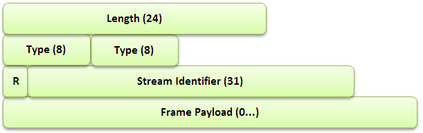<br>
  <em>Figure 1: The encoding a HTTP/2 frame.</em>
</p>

<h3>1.2 <em>Header Compression</em></h3>

The HTTP header is one of the primary methods of passing information about the state of other endpoints, the request or response and the payload.  This enables endpoints to save time when processing a large quantity to streams, with the ability to forward information along without wasting time to inspect the payload.  Since the header information can be quite large, it is possible to now compress the them to allow for better throughput and capacity of stored stateful information.

<h3>1.3 <em>Multiplexed Streams</em></h3>

As streams are core to the implementation of HTTP/2, it is important to discuss the details of their implemenation in the protocol.  As many streams can be open simultanously from many endpoints, each stream will be in one of the following states.  Each stream is multiplexed together forming a chain of streams that are transmitted over the wire, allowing for asynchronous bi-directional concurrency to be performed by the receiving endpoint.  Below is the lifecycle of a stream :

<p align="center">
  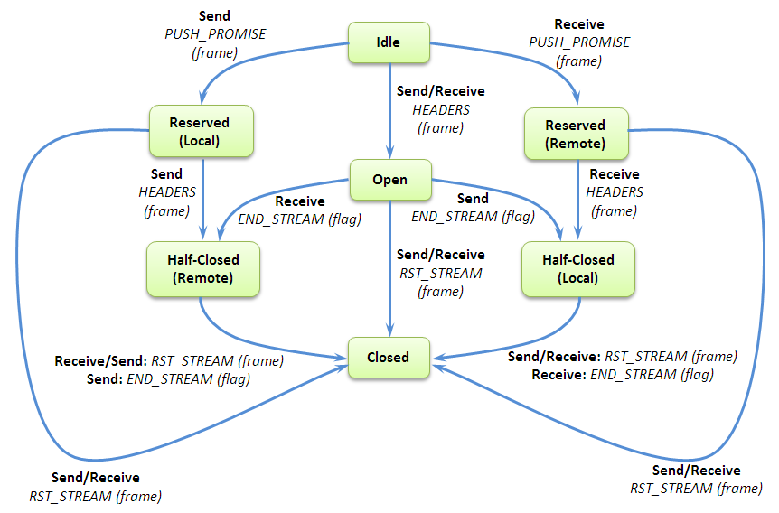<br>
  <em>Figure 2: The lifecycle of a HTTP/2 stream.</em>
</p>

To better understand this diagram, it is important to define some of the terms in it:

<em>PUSH_PROMISE</em> - This is being performed by one endpoint to alert another that it will be sending some data over the wire.

<em>RST_STREAM</em> - This makes termination of a stream possible.

<em>PRIORITY</em> - This is sent by an endpoint on the priority of a stream.

<em>END_STREAM</em> - This flag denotes the end of a <em>DATA</em> frame.

<em>HEADERS</em> - This frame will open a stream.

<em>Idle</em> - This is a state that a stream can be in when it is opened by receiving a <em>HEADERS</em> frame.

<em>Reserved (Local)</em> - To be in this state is means that one has sent a PUSH_PROMISE frame.

<em>Reserved (Remote)</em> - To be in this state is means that it has been reserved by a remote endpoint.

<em>Open</em> - To be in this state means that both endpoints can send frames.

<em>Closed</em> - This is a terminal state.

<em>Half-Closed (Local)</em> - This means that no frames can be sent except for <em>WINDOW_UPDATE</em>, <em>PRIORITY</em>, and <em>RST_STREAM</em>.

<h3>1.4 <em>Flow Control of Streams</em></h3>

Since many streams will compete for the bandwidth of a connection, in order to prevent bottlenecks and collisions in the transmission.  This is done via the <em>WINDOW_UPDATE</em> payload for every stream - and the overall connection as well - to let the sender know how much room the receiving endpoint has for processing new data.

<h3>2 <em>Protocol Buffers with RPC</em></h3>

Though gRPC was built on top of HTTP/2, an IDL had to be used to perform the communication between endpoints.  The natural direction was to use Protocol Buffers is the method of stucturing data for serialization between a server and client.  At the time of the start of gRPC development only version 2.0 (proto2) was available, which only implemented data structures without any request/response mechanism.  An example of a Protocol Buffer data structure would look something like this:

```
// A message containing the user's name.
message Hello {
  string name = 1;
}
```
<p align="center">
  <em>Figure 3: Protocol Buffer version 2.0 representing a message data-structure.</em>
</p>

This message will also be encoded for highest compression when sent over the wire.  For example, let us say that the message is the string <em>"Hi"</em>.  Every Protocol Buffer type has a value, and in this case a string has a value of `2`, as noted in the Table 1 .

<p align="center">
  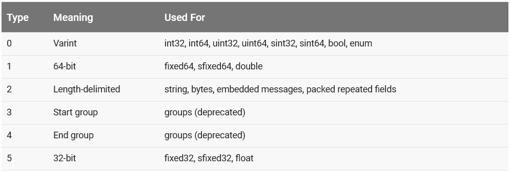<br>
  <em>Table 1: Tag values for Protocol Buffer types.</em>
</p>

One will notice that there is a number associated with each field element in the Protocol Buffer definition, which represents its <em>tag</em>.  In Figure 3, the field `name` has a tag of `1`.  When a message gets encoded each field will start with a one byte value (8 bits), where the least-significant 3-bit value encode the <em>type</em> and the rest the <em>tag</em>.  In this case tag which is `1`, with a type of 2.  Thus the encoding will be `00001 010`, which has a hexdecimal value of `A`.  The following byte is the length of the string which is `2`, followed by the string as `48` and `69` representing `H` and `i`.  Thus the whole tranmission will look as follows:

```
A 2 48 69
```

Thus the language had to be updated to support gRPC and the development of a service message with a request and a response definition was added for version version 3.0.0 of Protocol Buffers.  The updated implementation would look as follows :

```
// The request message containing the user's name.
message HelloRequest {
  string name = 1;
}

// The response message containing the greetings
message HelloReply {
  string message = 1;
}

// The greeting service definition.
service Greeter {
  // Sends a greeting
  rpc SayHello (HelloRequest) returns (HelloReply) {}
}
```
<p align="center">
  <em>Figure 4: Protocol Buffer version 3.0.0 representing a message data-structure with the accompanied RPC definition.</em>
</p>

Notice the addition of a service, where the RPC call would use one of the messages as the structure of a <em>Request</em> with the other being the <em>Response</em> message format.

Once of these Proto file gets generated, one would then use them to compile with gRPC to for generating the <em>Client</em> and <em>Server</em> files representing the classical two endpoints of a RPC implementation.

<h3>3 <em>gRPC</em></h3>

gRPC was built on top of HTTP/2, and we will cover the specifics of gRPC-Java, but expand it to all the implementations with time.  gRPC is a cross-platform framework that allows integration across many languages as denoted in Figure 5 .

<p align="center">
  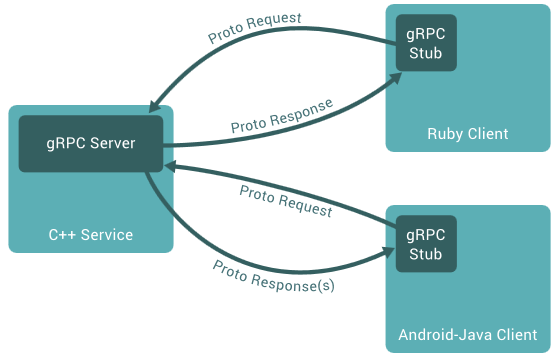<br>
  <em>Figure 5: gRPC allows for asynchronous language-agnostic message passing via Protocol Buffers.</em>
</p>

To ensure scalability, benchmarks are run on a daily basis to ensure that gRPC performs optimally under high-throughput conditions as illustrated in Figure 6 .

<p align="center">
  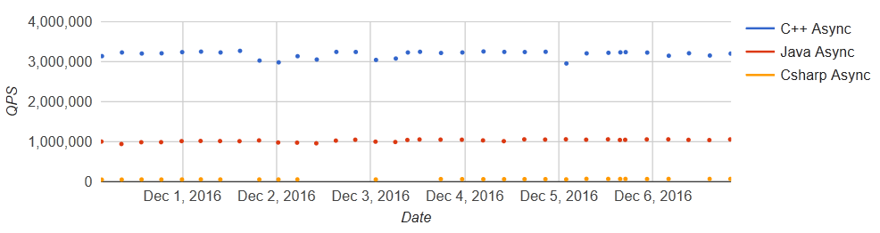<br>
  <em>Figure 6: Benchmark showing the queries-per-second on two virtual machines with 32 cores each.</em>
</p>

To standardize, most of the public Google APIs - including the Speech API, Vision API, Bigtable, Pub/Sub, etc. - have been ported to support gRPC, and their definitions can be found at the following location:

<p align="center">
  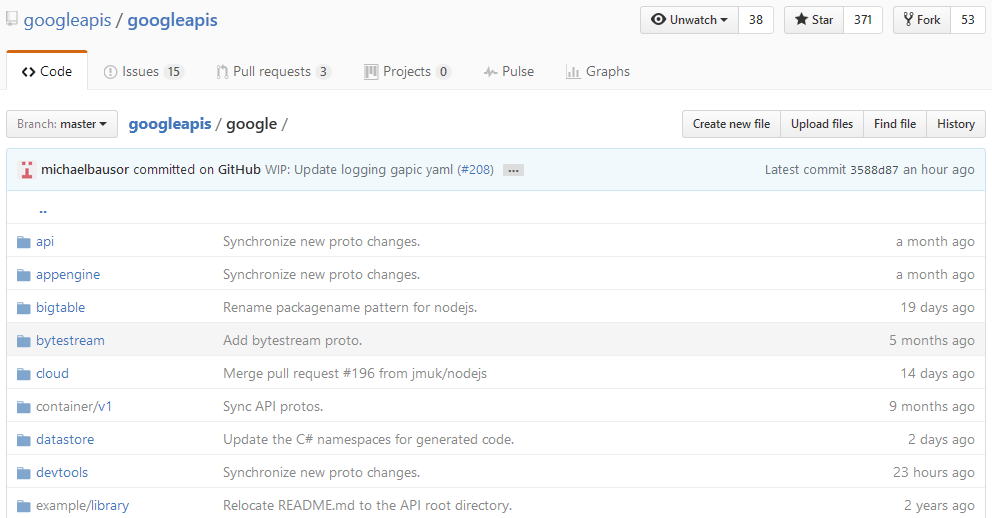<br>
  <em>Figure 7: The public Google APIs have been updated for gRPC, and be found at <a href="https://github.com/googleapis/googleapis/tree/master/google">https://github.com/googleapis/googleapis/tree/master/google</a></em>
</p>


<h3>3.1 <em>Supported Languages</em></h3>

The officially supported languages are listed in Table 2 .

<p align="center">
  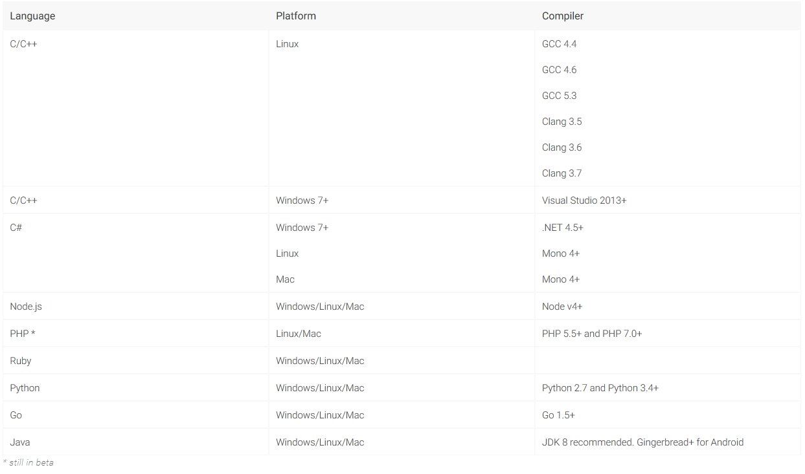<br>
  <em>Table 2: Officially supported languages by gRPC.</em>
</p>

<h3>3.2 <em>Authentication</em></h3>

There are two methods of authentication that are available in gRPC:

* SSL/TLS
* Google Token (via OAuth2)

gRPC is flexible in that once can plug in their custom authentication system if that is preferred.

<h3>3.3 <em>Development Cycle</em></h3>

In its simplest form gRPC has a structured set of steps one goes about using it, which has this general flow:

<em>1. Download gRPC for the language of interest.</em>

<em>2. Implement the Request and Response definition in a ProtoBuf file.</em>

<em>3. Compile the ProtoBuf file and run the code-generators for the the specific language.  This will generate the Client and Server endpoints.</em>

<em>4. Customize the Client and Server code for the desired implementation.</em>

Most of these will require tweaking the Protobuf file and testing the throughput to ensure that the network and CPU capacities are optimally maximized.

<h3>3.4 <em>The gRPC Framework (Stub, Channel and Transport Layer)</em></h3>

One starts by initializing a communication <em>Channel</em> between <em>Client</em> to a <em>Server</em> and storing that as a <em>Stub</em>.  The <em>Credentials</em> are provided to the Channel when being initialized.  These form a <em>Context</em> for the Client's connection to the Server.  Then a <em>Request</em> can be built based on the definition in the Protobuf file.  The Request and associated expected<em>Response</em> is executed by the <em>service</em> constructed in the Protobuf file.  The Response is them parsed for any data coming from the Channel.

The connection can be asynchronous and bi-directionally streaming so that data is constantly flowing back and available to be read when ready.  This allows one to treat the Client and Server as endpoints where one can even adjust not just the flow but also intercept and decoration to filter and thus request and retrieve the data of interest.

The <em>Transport Layer</em> performs the retrieval and placing of binary protocol on the wire.  For <em>gRPC-Java</em> has three implementations, though a user can implement their own: <em>Netty, OkHttp, and inProcess.</em>

<h3>3.5 <em>gRPC Java</em></h3>

The Java implementation of gRPC been built with Mobile platform in mind and to provide that capability it requires JDK 6.0 to be supported.  Though the core of gRPC is built with data centers in mind - specifically to support C/C++ for the Linux platform - the Java and Go implementations are two very reliable platform to experiment the microservice ecosystem implementations.

There are several moving parts to understanding how gRPC-Java works.  The first important step is to ensure that the Client and Server stub inferface code get generated by the Protobuf plugin compiler.  This is usually placed in your <em>Gradle</em> build file called `build.gradle` as follows:

```
  compile 'io.grpc:grpc-netty:1.0.1'
  compile 'io.grpc:grpc-protobuf:1.0.1'
  compile 'io.grpc:grpc-stub:1.0.1'
```

When you build using Gradle, then the appropriate base code gets generated for you, which you can override to build your preferred implementation of the Client and Server.

Since one has to implement the HTTP/2 protocol, the chosen method was to have a <em>Metadata</em> class that will convert the key-value pairs into HTTP/2 Headers and vice-versa for the Netty implementation via <em>GrpcHttp2HeadersDecoder</em> and <em>GrpcHttp2OutboundHeaders</em>.

Another key insight is to understand that the code that handles the HTTP/2 conversion for the Client and the Server are being done via the <em>NettyClientHandler.java</em> and <em>NettyServerHandler.java</em> classes shown in Figures 8 and 9.

<p align="center">
  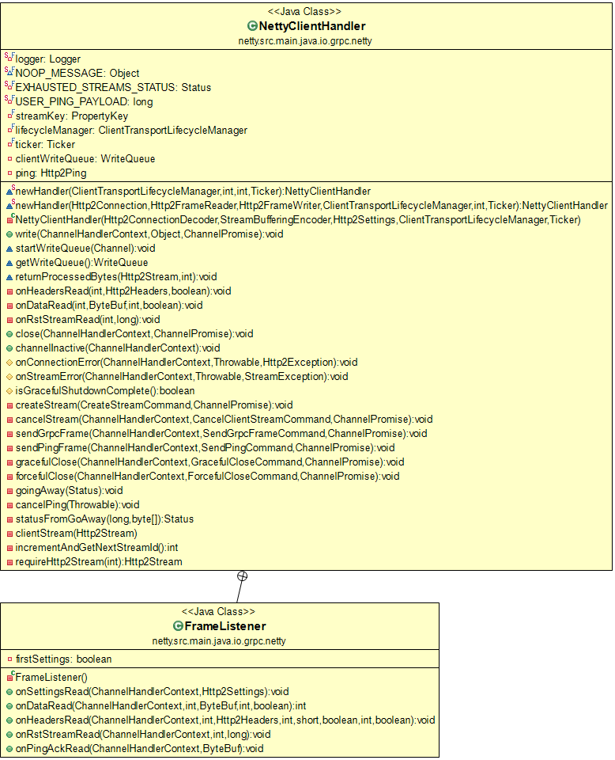<br>
  <em>Figure 8: The Client Tranport Handler for gRPC-Java.</em>
</p>

<p align="center">
  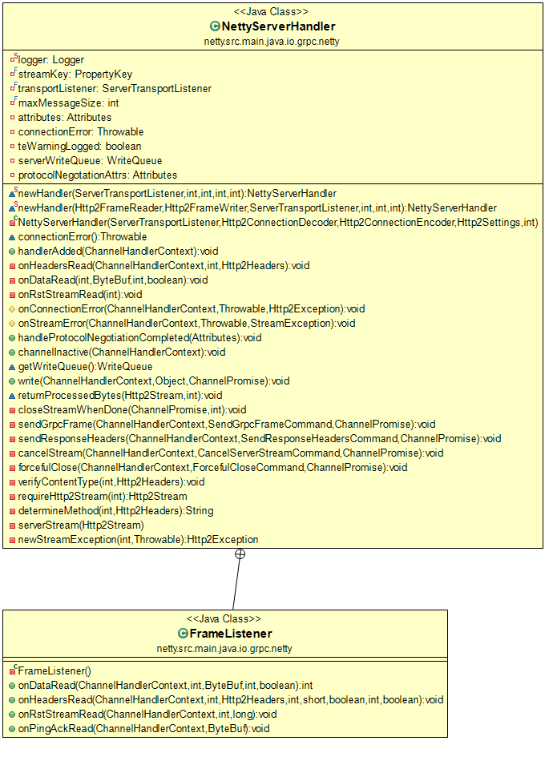<br>
  <em>Figure 9: The Server Tranport Handler for gRPC-Java.</em>
</p>


<h3>3.5.1 <em>Downloading gRPC Java</em></h3>

The easiest way to download the gRPC-Java implementation is by performing the following command:

```
git clone -b v1.0.0 https://github.com/grpc/grpc-java.git
```

Next compile on a Windows machine using Gradle (or Maven) using the following steps - and if you are using any Firewall software it might be necessary to temporarily disable it while compiling gRPC-Java as sockets are used for the tests:

```
cd grpc-java
set GRADLE_OPTS=-Xmx2048m
set JAVA_OPTS=-Xmx2048m
set DEFAULT_JVM_OPTS="-Dfile.encoding=utf-8"
echo skipCodegen=true > gradle.properties
gradlew.bat build -x test
cd examples
gradlew.bat installDist
```

If you are having issues with Unicode (UTF-8) translation when using Git on Windows, you can try the following commands after entering the `examples` folder:

```
wget https://raw.githubusercontent.com/benelot/grpc-java/feb88a96a4bc689631baec11abe989a776230b74/examples/src/main/java/io/grpc/examples/routeguide/RouteGuideServer.java

copy RouteGuideServer.java src\main\java\io\grpc\examples\routeguide\RouteGuideServer.java
```

<h3>3.5.2 <em>Running the Hello World Demonstration</em></h3>

Make sure you open two Command (Terminal) windows, each within the `grpc-java\examples\build\install\examples\bin` folder.  In the first of the two windows type the following command:

```
hello-world-server.bat
```

You should see the following:

<p align="center">
  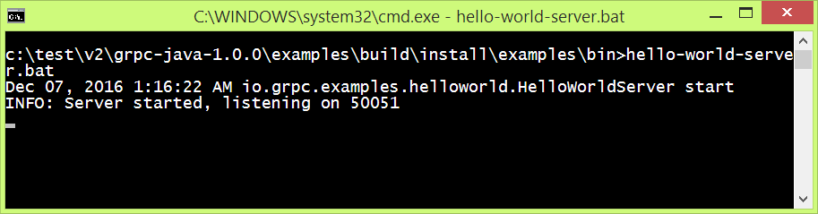<br>
  <em>Figure 10: The Hello World gRPC Server.</em>
</p>

In the second of the two windows type the following command:

```
hello-world-client.bat
```

You should see the following response:

<p align="center">
  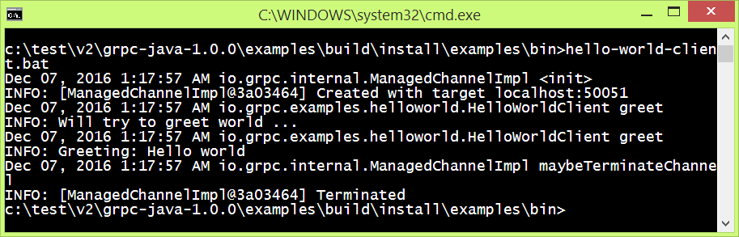<br>
  <em>Figure 10: The Hello World gRPC Client and the response from the Server.</em>
</p>

## References

` `[Apigee]: https://www.youtube.com/watch?v=-2sWDr3Z0Wo

` `[Authentication]: http://www.grpc.io/docs/guides/auth.html

` `[Benchmarks]: http://www.grpc.io/docs/guides/benchmarking.html

` `[CoreSurfaceAPIs]: https://github.com/grpc/grpc/tree/master/src/core

` `[ErrorModel]: http://www.grpc.io/docs/guides/error.html

` `[gRPC]: https://github.com/grpc/grpc/blob/master/doc/g_stands_for.md

` `[gRPC-Companies]: http://www.grpc.io/about/

` `[gRPC-Languages]: http://www.grpc.io/docs/

` `[gRPC-Protos]: https://github.com/googleapis/googleapis/ 

` `[Netty]: http://netty.io/ 

` `[RFC7540]: http://httpwg.org/specs/rfc7540.html  

` `[HelloWorldProto]: https://github.com/grpc/grpc/blob/master/examples/protos/
helloworld.proto

` `[Protobuf-Types]: https://developers.google.com/protocol-buffers/docs/encoding

` `[gRPC-Overview]: http://www.grpc.io/docs/guides/

` `[gRPC-Languages]: http://www.grpc.io/about/#osp

` `[gRPC-Benchmark]: http://www.grpc.io/docs/guides/benchmarking.html
