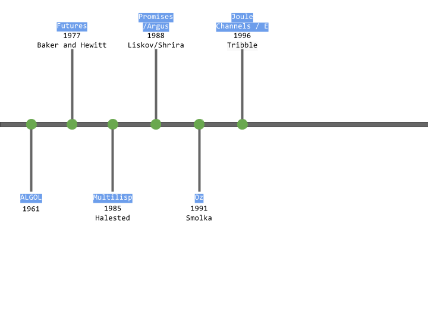

#Introduction

As human beings we have an ability to multitask ie. we can walk, talk and eat at the same time except when you sneeze. Sneeze is like a blocking activity from the normal course of action, because it forces you to stop what you’re doing for a brief moment and then you resume where you left off. Activities like multitasking are called multithreading in computer lingo. In contrast to this behaviour, computer processors are single threaded. So when we say that a computer system has multi-threaded environment, it is actually just an illusion created by processor where processor’s time is shared between multiple processes. Sometimes processor gets blocked when some tasks are hindered from normal execution due to blocking calls. Such blocking calls can range from IO operations like read/write to disk or sending/receiving packets to/from network. Blocking calls can take disproportionate amount of time compared to the processor’s task execution i.e. iterating over a list. 

The processor can either handle blocking calls in two ways:
- **Synchronous method**: As a part of running task in synchronous method, processor continues to wait for the blocking call to complete the task and return the result. After this processor will resume processing next task. Problem with this kind of method is CPU time not utilized in an ideal manner.
- **Asynchronous method**: When you add asynchrony, you can utilize the time of CPU to work on some other task using one of the preemptive time sharing algorithm. Now when the asynchronous call returns the result, processor can again switch back to the previous process using preemption and resume the process from the point where it’d left off.

In the world of asynchronous communications many terminologies were defined to help programmers reach the ideal level of resource utilization. As a part of this article we will talk about motivation behind rise of Promises and Futures, we will explain programming model associated with it and discuss evolution of this programming construct, finally we will end this discussion with how this construct helps us today in different general purpose programming languages.

<figure class="main-container">
  
</figure>

## References


