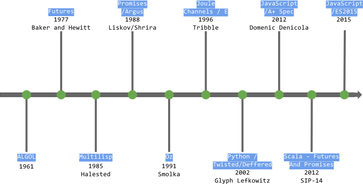
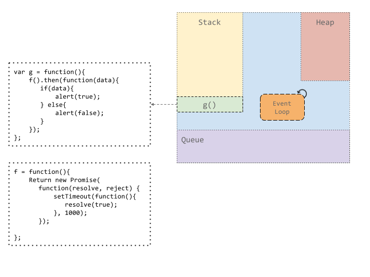
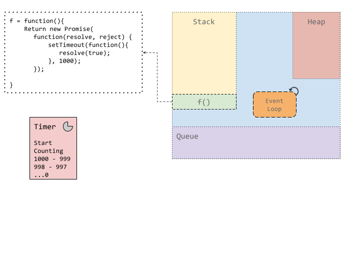
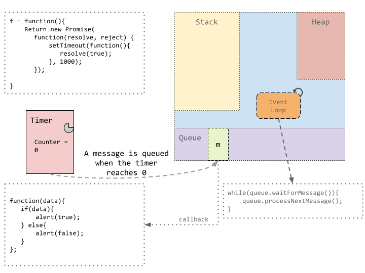
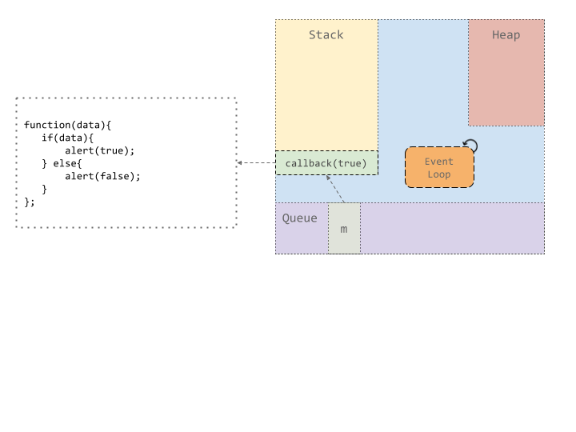
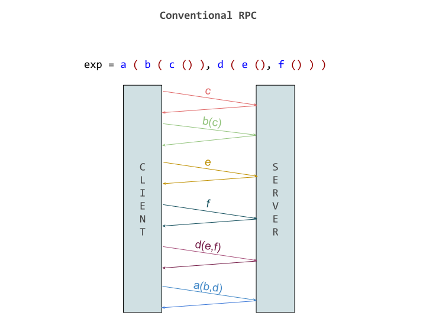

## Introduction

As human beings we have the ability to multitask _i.e._ we can walk, talk, and eat at the same time except when sneezing. Sneezing is a blocking activity because it forces you to stop what you’re doing for a brief moment, and then you resume where you left off. One can think of the human sense of multitasking as multithreading in the context of computers.

Consider for a moment a simple computer processor; no parallelism, just the ability to complete one task or process at a time. In this scenario, sometimes the processor is blocked when some blocking operation is called. Such blocking calls can include I/O operations like reading/writing to disk, or sending or receiving packets over the network. And as programmers, we know that blocking calls like I/O can take a disproportionately more time than a typical CPU-bound task, like iterating over a list.

The processor can handle blocking calls in two ways:

- **Synchronously**: the processor waits until the blocking call completes its task and returns the result. Afterwards, the processor will move on to processing the next task. _This can oftentimes be problematic because the CPU may not be utilized in an efficient manner; it may wait for long periods of time._
- **Asynchronously**: When tasks are processed  asynchronously, CPU time spent waiting in the synchronous case is instead spent processing some other task using a preemptive time sharing algorithm. That is, rather than wait, process some other task instead. Thus, the processor is never left waiting at any time.

In the world of programming, many constructs have been introduced in order to help programmers reach ideal levels of resource utilization. Arguably one of the most widely-used of which are futures and/or promises.

In this chapter, we'll do a deep dive into futures and promises, a popular abstraction for doing both synchronous and asynchronous programming. We'll go through the motivation for and history of these abstractions, understand what sort of scenarios they're useful for, and cover how they have evolved over time. We'll cover the various models of execution associated with these abstractions, and finally we'll touch on the futures and promises most widely utilized today in different general purpose programming languages such as JavaScript, Scala, and C++.

## The Basic Idea

As we'll see in subsequent sections, what we choose to call this concept, and its precise definition tends to vary. We will start with the widest possible definition of the concept of a future/promise, and later zoom in and cover the many semantic differences between different languages' interpretations of these constructs.

In the broadest sense,

<blockquote>
  <p>A <i>future or promise</i> can be thought of as a value that will <i>eventually</i> become available.</p>
</blockquote>

Or said another way, it is an abstraction which encodes a notion of time. By choosing to use this construct, it is assumed that your value can now have many possible states, depending on the point in time which we request it. The simplest variation includes two time-dependent states; a future/promise is either:

1. **_completed_/_determined_**: the computation is complete and the future/promise's value is available.
2. **_incomplete_/_undetermined_**: the computation is not yet complete.

As we'll later see, other states have been introduced in some variations of futures/promises to better support needs like error-handling and cancellation.

Importantly, futures/promises typically enable some degree of concurrency. That is, in one of first defitions of futures:

<blockquote>
  <p>The construct <code>( future X )</code> immediately returns a future for the value of the expression <code>X</code> and <strong>concurrently</strong> begins evaluating <code>X</code>. When the evaluation of <code>X</code> yields a value, that value replaces the future.</p>
  <footer></footer>
</blockquote>

Some interpretations of futures/promises have a type associated with them, others not. Typically a future/promise is single-assignment; that is, you it can only be written to once. Some interpretations are blocking (synchronous), others are completely non-blocking (asynchronous). Some interpretations must be explicitly _kicked off_ (i.e., manually started), while in other interpretations, computation is started implicitly.

Inspired by functional programming, one of the major distinctions between different interpretations of this construct have to do with _pipelineing_ or _composition_. Some of the more popular interpretations of futures/promises make it possible to _chain_ operations, or define a pipeline of operations to be invoked upon completion of the computation represented by the future/promise. This is in contrast to callback-heavy or more imperative direct blocking approaches.

## Motivation and Uses

The rise of promises and futures as a topic of relevance has for the most part occurred alongside of the rise of parallel and concurrent programming and distributed systems. This follows somewhat naturally, since, as an abstraction which encodes time, futures/promises introduce a nice way to reason about state changes when latency becomes an issue; a common concern faced by programmers when a node must communicate with another node in a distributed system.

However promises and futures are considered useful in a number of contexts as well, both distributed and not. Some such contexts include:

- **Request-Response Patterns**, such as web service calls over HTTP. A future may be used to represent the value of the response of the HTTP request.
- **Input/Output**, such as UI dialogs requiring user input, or operations such as reading large files from disk. A future may be used to represent the IO call and the resulting value of the IO (e.g., terminal input, array of bytes of a file that was read).
- **Long-Running Computations**. Imagine you would like the process which initiated a long-running computation, such as a complex numerical algorithm, not to wait on the completion of that long-running computation and to instead move on to process some other task. A future may be used to represent this long-running computation and the value of its result.
- **Database Queries**. Like long-running computations, database queries can be time-consuming. Thus, like above, it may be desirable to offload the work of doing the query to another process and move on to processing the next task. A future may be used to represent the query and resulting value of the query.
- **RPC**. Network latency is typically an issue when making an RPC call to a server. Like above, it may be desirable to not have to wait on the result of the RPC invocation by instead offloading it to another process. A future may be used to represent the RPC call and its result; when the server responds with a result, the future is completed and its value is the server's response.
- **Reading Data from a Socket** can be time-consuming particularly due to network latency. It may thus be desirable to not to have to wait on incoming data, and instead to offload it to another process. A future may be used to represent the reading operation and the resulting value of what it reads when the future is completed.
- **Timeouts**, such as managing timeouts in a web service. A future representing a timeout could simply return no result or some kind of empty result like the `Unit` type in typed programming languages.


Many real world services and systems today make heavy use of futures/promises in popular contexts such as these, thanks to the notion of a future or a promise having been introduced in popular languages and frameworks such as JavaScript, NodeJS, Scala, Java, C++, amongst many others. As we will see in further sections, this proliferation of futures/promises has resulted in futures/promises changing meanings and names over time and across languages.


## Diverging Terminology

_Future_, _Promise_, _Delay_ or _Deferred_ generally refer to roughly the same synchronization mechanism where an object acts as a proxy for as-of-yet unknown result. When the result is available, some other code then gets executed. Over the years, these terms have come to refer to slightly different semantic meanings between languages and ecosystems.

Sometimes, a language may have _one_ construct named future, promise, delay, deferred, etc.

However, in other cases, a language may have _two_ constructs, typically referred to as futures and promises. Languages like Scala, Java, and Dart fall into this category. In this case,

- A `Future` is a read-only reference to a yet-to-be-computed value.
- A `Promise` (or a `CompletableFuture`/`Completer`/etc) is a single-assignment variable which the `Future` refers to.

In other words, a future is a read-only window to a value written into a promise. You can get the `Future` associated with a `Promise` by calling the `future` method on it, but conversion in the other direction is not possible. Another way to look at it would be, if you _promise_ something to someone, you are responsible for keeping it, but if someone else makes a _promise_ to you, you expect them to honor it in the _future_.

In Scala, they are defined as follows:

<blockquote>
  <p>A future is a placeholder object for a result that does not yet exist.
     A promise is a writable, single-assignment container, which completes a future. Promises can complete the future with a result to indicate success, or with an exception to indicate failure.
  </p>
  <footer></footer>
</blockquote>

An important difference between Scala and Java (6) futures is that Scala futures are asynchronous in nature. Java's future, at least till Java 6, were blocking. Java 7 introduced asynchronous futures to great fanfare.

In Java 8, the `Future<T>` interface has methods to check if the computation is complete, to wait for its completion, and to retrieve the result of the computation when it is complete. `CompletableFutures` can be thought of as something of a promise, since their value can be explicitly set. However, `CompletableFuture` also implements the `Future` interface allowing it to be used as a `Future` as well. Promises can be thought of as a future with a public set method which the caller (or anybody else) can use to set the value of the future.

In the JavaScript world, JQuery introduces a notion of `Deferred` objects which are used to represent a unit of work which is not yet finished. The `Deferred` object contains a promise object which represents the result of that unit of work. Promises are values returned by a function. The deferred object can also be canceled by its caller.

Like Scala and Java, C# also makes the distinction between the future and promise constructs described above. In C#, futures are called `Task<T>`s, and promises are called `TaskCompletionSource<T>`. The result of the future is available in the read-only property `Task<T>.Result` which returns `T`, and `TaskCompletionSource<T>.Task<TResult>` has methods to complete the `Task` object with a result of type `T` or with an exception or cancellation. Important to note; `Task`s are asynchronous in C#.

And confusingly, the JavaScript community has standardized on a single construct known as a `Promise` which can be used like other languages' notions of futures. The Promises specification  defines only a single interface and leaves the details of completing (or _fulfilling_) the promise to the implementer of the spec. Promises in JavaScript are also asynchronous and able to be pipelined. JavaScript promises are enabled by default in browsers that support ECMAScript 6 (EC6), or are available in a number of libraries such as [Bluebird](http://bluebirdjs.com/docs/getting-started.html) and [Q](https://github.com/kriskowal/q).

As we can see, concepts, semantics, and terminology seem to be a bit mixed up between languages and library implementations of futures/promises. These differences in terminology and semantics arise from the long history and independent language communities that have proliferated the use of futures/promises.


## History

Here's a brief glimpse at a timeline spanning the history of futures and promises as we know them today:


<figure style="margin-left: 0px; width: 110%;">
  
</figure>

Conceptually, futures and promises begin in 1961 with so-called _thunks_. Thunks can be thought of as a primitive notion of a Future or Promise. According to its inventor P. Z. Ingerman, thunks are:

<blockquote>
  <p>A piece of coding which provides an address</p>
  <footer></footer>
</blockquote>

Thunks were designed as a way of binding actual parameters to their formal definitions in Algol-60 procedure calls. If a procedure is called with an expression in the place of a formal parameter, the compiler generates a thunk which computes the expression and leaves the address of the result in some standard location. Think of a thunk as a continuation or a function that was intended to be evaluated in a single-threaded environment.

The first mention of Futures was by Baker and Hewitt in a paper on Incremental Garbage Collection of Processes . They coined the term, _call-by-futures_, to describe a calling convention in which each formal parameter to a method is bound to a process which evaluates the expression in the parameter in parallel with other parameters. Before this paper, Algol 68 **** also presented a way to make this kind of concurrent parameter evaluation possible, using the collateral clauses and parallel clauses for parameter binding.

In their paper, Baker and Hewitt introduced a notion of Futures as a 3-tuple representing an expression `E` consisting of:

1. A process which evaluates `E`,
2. A memory location where the result of `E` needs to be stored,
3. A list of processes which are waiting on `E`.

Though importantly, the focus of their work was not on role of futures and the role they play in asynchronous distributed computing. Instead, it was focused on garbage collecting the processes which evaluate expressions that were not needed by the function.

The Multilisp language, presented by Halestead in 1985 built upon this call-by-future with a Future annotation. Binding a variable to a future expression creates a process which evaluates that expression and binds x to a token which represents its (eventual) result. It allowed an operation to move past the actual computation without waiting for it to complete. If the value is never used, the current computation will not pause. MultiLisp also had a lazy future construct, called Delay, which only gets evaluated when the value is first required.

 This design of futures influenced the paper of design of Promises in Argus by Liskov and Shrira in 1988. Both futures in MultiLisp and Promises in Argus provisioned for the result of a call to be picked up later. Building upon the initial design of Future in MultiLisp, they extended the original idea by introducing strongly typed Promises and integration with call streams. Call streams are a language-independent communication mechanism connecting a sender and a receiver in a distributed programming environment. It is used to make calls from sender to receiver like normal RPC. In addition, sender could also make stream-calls where it chooses to not wait for the reply and can make further calls. Stream calls seem like a good use-case for a placeholder to access the result of a call in the future : Promises. Call streams also had provisions for handling network failures. This made it easier to handle exception propagation from callee to the caller and also to handle the typical problems in a multi-computer system. This paper also talked about stream composition. The call-streams could be arranged in pipelines where output of one stream could be used as input on next stream. This notion is not much different to what is known as promise pipelining today, which will be introduced in more details later.


E is an object-oriented programming language for secure distributed computing, created by Mark S. Miller, Dan Bornstein, and others at Electric Communities in 1997. One of the major contribution of E was the first non-blocking implementation of Promises. It traces its routes to Joule which was a dataflow programming language. E had an eventually operator, `* <- *` . This created what is called an eventual send in E : the program doesn't wait for the operation to complete and moves to next sequential statement. Eventual-sends queue a pending delivery and complete immediately, returning a promise. A pending delivery includes a resolver for the promise. Further messages can also be eventually send to a promise before it is resolved. These messages are queued up and forwarded once the promise is resolved. The notion of promise pipelining in E is also inherited from Joule.


Among the modern languages, Python was perhaps the first to come up with something on the lines of E’s promises with the Twisted library. Coming out in 2002, it had a concept of Deferred objects, which were used to receive the result of an operation not yet completed. They were just like normal objects and could be passed along, but they didn’t have a value. They supported a callback which would get called once the result of the operation was complete.


Promises and javascript have an interesting history. In 2007 inspired by Python’s twisted, dojo came up with it’s own implementation of of dojo.Deferred. This inspired Kris Zyp to then come up with the CommonJS Promises/A spec in 2009. Ryan Dahl introduced the world to NodeJS in the same year. In it’s early versions, Node used promises for the non-blocking API. When NodeJS moved away from promises to its now familiar error-first callback API (the first argument for the callback should be an error object), it left a void for a promises API.  Q.js was an implementation of Promises/A spec by Kris Kowal around this time. FuturesJS library by AJ ONeal was another library which aimed to solve flow-control problems without using Promises in the strictest of senses. In 2011, JQuery v1.5 first introduced Promises to its wider and ever-growing audience. The API for JQuery was subtly different than the Promises/A spec. With the rise of HTML5 and different APIs, there came a problem of different and messy interfaces which added to the already infamous callback hell. A+ promises aimed to solve this problem. From this point on, leading from widespread adoption of A+ spec, promises was finally made a part of ECMAScript® 2015 Language Specification. Still, a lack of backward compatibility and additional features provided means that libraries like BlueBird and Q.js still have a place in the javascript ecosystem.

## Semantics of Execution

Over the years promises and futures have been implemented in different programming languages. Different languages chose to implement  futures/promises in a different way. In this section, we try to introduce some different ways in which futures and promises actually get executed and resolved underneath their APIs.

### Thread Pools

Thread pools are a group of ready, idle threads which can be given work. They help with the overhead of worker creation, which can add up in a long running process. The actual implementation may vary everywhere, but what differentiates thread pools is the number of threads it uses. It can either be fixed, or dynamic. Advantage of having a fixed thread pool is that it degrades gracefully : the amount of load a system can handle is fixed, and using fixed thread pool, we can effectively limit the amount of load it is put under. Granularity of a thread pool is the number of threads it instantiates.


In Java executor is an object which executes the Runnable tasks. Executors provides a way of abstracting out how the details of how a task will actually run. These details, like selecting a thread to run the task, how the task is scheduled are managed by the object implementing the Executor interface. Threads are an example of a Runnable in java. Executors can be used instead of creating a thread explicitly.


Similar to Executor, there is an ExecutionContext as part of scala.concurrent. The basic intent behind it is same as an Executor : it is responsible for executing computations. How it does it can is opaque to the caller. It can create a new thread, use a pool of threads or run it on the same thread as the caller, although the last option is generally not recommended. Scala.concurrent package comes with an implementation of ExecutionContext by default, which is a global static thread pool.


ExecutionContext.global is an execution context backed by a ForkJoinPool. ForkJoin is a thread pool implementation designed to take advantage of a multiprocessor environment. What makes fork join unique is that it implements a type of work-stealing algorithm : idle threads pick up work from still busy threads. ForkJoinPool manages a small number of threads, usually limited to the number of processor cores available. It is possible to increase the number of threads, if all of the available threads are busy and wrapped inside a blocking call, although such situation would be highly undesirable for most of the systems. ForkJoin framework work to avoid pool-induced deadlock and minimize the amount of time spent switching between the threads.


In Scala, Futures are generally a good framework to reason about concurrency as they can be executed in parallel, waited on, are composable, immutable once written and most importantly, are non blocking (although it is possible to have blocking futures, like Java 6). In Scala, futures (and promises) are based on ExecutionContext. Using ExecutionContext gives users flexibility to implement their own ExecutionContext if they need a specific behavior, like blocking futures. The default ForkJoin pool works well in most of the scenarios.

Scala futures api expects an ExecutionContext to be passed along. This parameter is implicit, and usually ExecutionContext.global. An example :


```scala
implicit val ec = ExecutionContext.global
val f : Future[String] = Future { “hello world” }
```

In this example, the global execution context is used to asynchronously run the created future.  Taking another example,


```scala
implicit val ec = ExecutionContext.global

val f = Future {
  Http("http://api.fixed.io/latest?base=USD").asString
}

f.onComplete {
  case success(response) => println(response.body)
  case Failure(t) => println(t)
}
```


It is generally a good idea to use callbacks with Futures, as the value may not be available when you want to use it.

So, how does it all work together ?

As we mentioned, Futures require an ExecutionContext, which is an implicit parameter to virtually all of the futures API. This ExecutionContext is used to execute the future. Scala is flexible enough to let users implement their own Execution Contexts, but let’s talk about the default ExecutionContext, which is a ForkJoinPool.


ForkJoinPool is ideal for many small computations that spawn off and then come back together. Scala’s ForkJoinPool requires the tasks submitted to it to be a ForkJoinTask. The tasks submitted to the global ExecutionContext is quietly wrapped inside a ForkJoinTask and then executed. ForkJoinPool also supports a possibly blocking task, using ManagedBlock method which creates a spare thread if required to ensure that there is sufficient parallelism if the current thread is blocked. To summarize, ForkJoinPool is an really good general purpose ExecutionContext, which works really well in most of the scenarios.


### Event Loops

Modern systems typically rely on many other systems to provide the functionality they do. There’s a file system underneath, a database system, and other web services to rely on for the information. Interaction with these components typically involves a period where we’re doing nothing but waiting for the response back. This is single largest waste of computing resources.


Javascript is a single threaded asynchronous runtime. Now, conventionally async programming is generally associated with multi-threading, but we’re not allowed to create new threads in Javascript. Instead, asynchronicity in Javascript is achieved using an event-loop mechanism.


Javascript has historically been used to interact with the DOM and user interactions in the browser, and thus an event-driven programming model was a natural fit for the language. This has scaled up surprisingly well in high throughput scenarios in NodeJS.


The general idea behind event-driven programming model is that the logic flow control is determined by the order in which events are processed. This is underpinned by a mechanism which is constantly listening for events and fires a callback when it is detected. This is the Javascript’s event loop in a nutshell.


A typical Javascript engine has a few basic components. They are :
- **Heap**
Used to allocate memory for objects
- **Stack**
Function call frames go into a stack from where they’re picked up from top to be executed.
- **Queue**
	A message queue holds the messages to be processed.


Each message has a callback function which is fired when the message is processed. These messages can be generated by user actions like button clicks or scrolling, or by actions like HTTP requests, request to a database to fetch records or reading/writing to a file.


Separating when a message is queued from when it is executed means the single thread doesn’t have to wait for an action to complete before moving on to another. We attach a callback to the action we want to do, and when the time comes, the callback is run with the result of our action. Callbacks work good in isolation, but they force us into a continuation passing style of execution, what is otherwise known as Callback hell.


```javascript

getData = function(param, callback){
  $.get('http://example.com/get/'+param,
    function(responseText){
      callback(responseText);
    });
}

getData(0, function(a){
    getData(a, function(b){
        getData(b, function(c){
            getData(c, function(d){
                getData(d, function(e){

                });
            });
        });
    });
});

```

<center><h4> VS </h4></center>

```javascript

getData = function(param, callback){
  return new Promise(function(resolve, reject) {
    $.get('http://example.com/get/'+param,
    function(responseText){
      resolve(responseText);
    });
  });
}

getData(0).then(getData)
  .then(getData).
    then(getData).
      then(getData);


```

> **Programs must be written for people to read, and only incidentally for machines to execute.** - *Harold Abelson and Gerald Jay Sussman*


Promises are an abstraction which make working with async operations in javascript much more fun. Callbacks lead to inversion of control, which is difficult to reason about at scale. Moving on from a continuation passing style, where you specify what needs to be done once the action is done, the callee simply returns a Promise object. This inverts the chain of responsibility, as now the caller is responsible for handling the result of the promise when it is settled.

The ES2015 spec specifies that “promises must not fire their resolution/rejection function on the same turn of the event loop that they are created on.” This is an important property because it ensures deterministic order of execution. Also, once a promise is fulfilled or failed, the promise’s value MUST not be changed. This ensures that a promise cannot be resolved more than once.

Let’s take an example to understand the promise resolution workflow as it happens inside the Javascript Engine.

Suppose we execute a function, here g() which in turn, calls function f(). Function f returns a promise, which, after counting down for 1000 ms, resolves the promise with a single value, true. Once f gets resolved, a value true or false is alerted based on the value of the promise.


<figure>
  
</figure>

Now, javascript’s runtime is single threaded. This statement is true, and not true. The thread which executes the user code is single threaded. It executes what is on top of the stack, runs it to completion, and then moves onto what is next on the stack. But, there are also a number of helper threads which handle things like network or timer/settimeout type events. This timing thread handles the counter for setTimeout.

<figure>
  
</figure>

Once the timer expires, the timer thread puts a message on the message queue. The queued up messages are then handled by the event loop. The event loop as described above, is simply an infinite loop which checks if a message is ready to be processed, picks it up and puts it on the stack for it’s callback to be executed.

<figure>
  
</figure>

Here, since the future is resolved with a value of true, we are alerted with a value true when the callback is picked up for execution.

<figure>
  
</figure>

Some finer details :
We’ve ignored the heap here, but all the functions, variables and callbacks are stored on heap.
As we’ve seen here, even though Javascript is said to be single threaded, there are number of helper threads to help main thread do things like timeout, UI, network operations, file operations etc.
Run-to-completion helps us reason about the code in a nice way. Whenever a function starts, it needs to finish before yielding the main thread. The data it accesses cannot be modified by someone else. This also means every function needs to finish in a reasonable amount of time, otherwise the program seems hung. This makes Javascript well suited for I/O tasks which are queued up and then picked up when finished, but not for data processing intensive tasks which generally take long time to finish.
We haven’t talked about error handling, but it gets handled the same exact way, with the error callback being called with the error object the promise is rejected with.


Event loops have proven to be surprisingly performant. When network servers are designed around multithreading, as soon as you end up with a few hundred concurrent connections, the CPU spends so much of its time task switching that you start to lose overall performance. Switching from one thread to another has overhead which can add up significantly at scale. Apache used to choke even as low as a few hundred concurrent users when using a thread per connection while Node can scale up to a 100,000 concurrent connections based on event loops and asynchronous IO.


### Thread Model


Oz programming language introduced an idea of dataflow concurrency model. In Oz, whenever the program comes across an unbound variable, it waits for it to be resolved. This dataflow property of variables helps us write threads in Oz that communicate through streams in a producer-consumer pattern. The major benefit of dataflow based concurrency model is that it’s deterministic - same operation called with same parameters always produces the same result. It makes it a lot easier to reason about concurrent programs, if the code is side-effect free.


Alice ML is a dialect of Standard ML with support for lazy evaluation, concurrent, distributed, and constraint programming. The early aim of Alice project was to reconstruct the functionalities of Oz programming language on top of a typed programming language. Building on the Standard ML dialect, Alice also provides concurrency features as part of the language through the use of a future type. Futures in Alice represent an undetermined result of a concurrent operation. Promises in Alice ML are explicit handles for futures.


Any expression in Alice can be evaluated in it's own thread using spawn keyword. Spawn always returns a future which acts as a placeholder for the result of the operation. Futures in Alice ML can be thought of as functional threads, in a sense that threads in Alice always have a result. A thread is said to be touching a future if it performs an operation that requires the value future is a placeholder for. All threads touching a future are blocked until the future is resolved. If a thread raises an exception, the future is failed and this exception is re-raised in the threads touching it. Futures can also be passed along as values. This helps us achieve the dataflow model of concurrency in Alice.


Alice also allows for lazy evaluation of expressions. Expressions preceded with the lazy keyword are evaluated to a lazy future. The lazy future is evaluated when it is needed. If the computation associated with a concurrent or lazy future ends with an exception, it results in a failed future. Requesting a failed future does not block, it simply raises the exception that was the cause of the failure.

## Implicit vs. Explicit Promises


We define Implicit promises as ones where we don’t have to manually trigger the computation vs Explicit promises where we have to trigger the resolution of future manually, either by calling a start function or by requiring the value. This distinction can be understood in terms of what triggers the calculation : With Implicit promises, the creation of a promise also triggers the computation, while with Explicit futures, one needs to triggers the resolution of a promise. This trigger can in turn be explicit, like calling a start method, or implicit, like lazy evaluation where the first use of a promise’s value triggers its evaluation.


The idea for explicit futures were introduced in the Baker and Hewitt paper. They’re a little trickier to implement, and require some support from the underlying language, and as such they aren’t that common. The Baker and Hewitt paper talked about using futures as placeholders for arguments to a function, which get evaluated in parallel, but when they’re needed. MultiLisp also had a mechanism to delay the evaluation of the future to the time when it's value is first used, using the defer construct. Lazy futures in Alice ML have a similar explicit invocation mechanism, the first thread touching a future triggers its evaluation.

An example for Explicit Futures would be (from AliceML):

```
fun enum n = lazy n :: enum (n+1)

```

This example generates an infinite stream of integers and if stated when it is created, will compete for the system resources.

Implicit futures were introduced originally by Friedman and Wise in a paper in 1978. The ideas presented in that paper inspired the design of promises in MultiLisp. Futures are also implicit in Scala and Javascript, where they’re supported as libraries on top of the core languages. Implicit futures can be implemented this way as they don’t require support from language itself. Alice ML’s concurrent futures are also an example of implicit invocation.

For example

```scala

val f = Future {
  Http("http://api.fixer.io/latest?base=USD").asString
}

f onComplete  {
  case Success(response) => println(response.body)
  case Failure(t) => println(t)
}

```

This sends the HTTP call as soon as it the Future is created. In Scala, although the futures are implicit, Promises can be used to have an explicit-like behavior. This is useful in a scenario where we need to stack up some computations and then resolve the Promise.

An Example :

```scala

val p = Promise[Foo]()

p.future.map( ... ).filter( ... ) foreach println

p.complete(new Foo)

```

Here, we create a Promise, and complete it later. In between we stack up a set of computations which get executed once the promise is completed.


## Promise Pipelining

One of the criticism of traditional RPC systems would be that they’re blocking. Imagine a scenario where you need to call an API ‘a’ and another API ‘b’, then aggregate the results of both the calls and use that result as a parameter to another API ‘c’. Now, the logical way to go about doing this would be to call A and B in parallel, then once both finish, aggregate the result and call C. Unfortunately, in a blocking system, the way to go about is call a, wait for it to finish, call b, wait, then aggregate and call c. This seems like a waste of time, but in absence of asynchronicity, it is impossible. Even with asynchronicity, it gets a little difficult to manage or scale up the system linearly. Fortunately, we have promises.


<figure>
  
</figure>

<figure>
  
</figure>

Futures/Promises can be passed along, waited upon, or chained and joined together. These properties helps make life easier for the programmers working with them. This also reduces the latency associated with distributed computing. Promises enable dataflow concurrency, which is also deterministic, and easier to reason.

The history of promise pipelining can be traced back to the call-streams in Argus. In Argus, Call streams are a mechanism for communication between distributed components. The communicating entities, a sender and a receiver are connected by a stream, and sender can make calls to receiver over it. Streams can be thought of as RPC, except that these allow callers to run in parallel with the receiver while processing the call. When making a call in Argus, the caller receives a promise for the result. In the paper on Promises by Liskov and Shrira, they mention that having integrated Promises into call streams, next logical step would be to talk about stream composition. This means arranging streams into pipelines where output of one stream can be used as input of the next stream. They talk about composing streams using fork and coenter.

Channels in Joule were a similar idea, providing a channel which connects an acceptor and a distributor. Joule was a direct ancestor to E language, and talked about it in more detail.

```

t3 := (x <- a()) <- c(y <- b())

t1 := x <- a()
t2 := y <- b()
t3 := t1 <- c(t2)

```

Without pipelining in E, this call will require three round trips. First to send a() to x, then b() to y then finally c to the result t1 with t2 as an argument. But with pipelining, the later messages can be sent with promises as result of earlier messages as argument. This allowed sending all the messages together, thereby saving the costly round trips. This is assuming x and y are on the same remote machine, otherwise we can still evaluate t1 and t2 parallely.


Notice that this pipelining mechanism is different from asynchronous message passing, as in asynchronous message passing, even if t1 and t2 get evaluated in parallel, to resolve t3 we still wait for t1 and t2 to be resolved, and send it again in another call to the remote machine.


Modern promise specifications, like one in Javascript comes with methods which help working with promise pipelining easier. In javascript, a Promises.all method is provided, which takes in an iterable and returns a new Promise which gets resolved when all the promises in the iterable get resolved. There’s also a race method, which returns a promise which is resolved when the first promise in the iterable gets resolved.

```javascript

var a = Promise.resolve(1);
var b = new Promise(function (resolve, reject) {
  setTimeout(resolve, 100, 2);
});

Promise.all([p1, p2]).then(values => {
  console.log(values); // [1,2]
});

Promise.race([p1, p2]).then(function(value) {
  console.log(value); // 1
});

```

In Scala, futures have a onSuccess method which acts as a callback to when the future is complete. This callback itself can be used to sequentially chain futures together. But this results in bulkier code. Fortunately, Scala api comes with combinators which allow for easier combination of results from futures. Examples of combinators are map, flatmap, filter, withFilter.


## Handling Errors

If world would have run without errors we would rejoice in unison, but it is not the case in programming world as well. When you run a program you either receive an expected output or an error. Error can be defined as wrong output or an exception. In a synchronous programming model, the most logical way of handling errors is a try...catch block.

```javascript

try{
    do something1;
    do something2;
    do something3;
    ...
} catch ( exception ){
    HandleException;
}

```

Unfortunately, the same thing doesn’t directly translate to asynchronous code.


```javascript

foo = doSomethingAsync();

try{
    foo();
    // This doesn’t work as the error might not have been thrown yet
} catch ( exception ){
    handleException;
}


```


Although most of the earlier papers did not talk about error handling, the Promises paper by Liskov and Shrira did acknowledge the possibility of failure in a distributed environment. To put this in Argus's perspective, the 'claim' operation waits until the promise is ready. Then it returns normally if the call terminated normally, and otherwise it signals the appropriate 'exception', e.g.,

```
y: real := pt$claim(x)
    except when foo: ...
           when unavailable(s: string): .
           when failure(s: string): . .
    end

```
Here x is a promise object of type pt; the form pi$claim illustrates the way Argus identifies an operation of a type by concatenating the type name with the operation name. When there are communication problems, RPCs in Argus terminate either with the 'unavailable' exception or the 'failure' exception.
'Unavailable' -  means that the problem is temporary, e.g., communication is impossible right now.
'Failure' -  means that the problem is permanent, e.g., the handler’s guardian does not exist.
Thus stream calls (and sends) whose replies are lost because of broken streams will terminate with one of these exceptions. Both exceptions have a string argument that explains the reason for the failure, e.g., future(“handler does not exist”), or unavailable(“cannot communicate”). Since any call can fail, every handler can raise the exceptions failure and unavailable. In this paper they also talked about propagation of exceptions from the called procedure to the caller. In paper about E language they talk about broken promises and setting a promise to the exception of broken references.

In modern languages like Scala, Promises generally come with two callbacks. One to handle the success case and other to handle the failure. e.g.

```scala

f onComplete {
   case Success(data) => handleSuccess(data)
   case Failure(e) => handleFailure(e)
}
```

In Scala, the Try type represents a computation that may either result in an exception, or return a successfully computed value. For example, Try[Int] represents a computation which can either result in Int if it's successful, or return a Throwable if something is wrong.

```scala

val a: Int = 100
val b: Int = 0
def divide: Try[Int] = Try(a/b)

divide match {
  case Success(v) =>
    println(v)
  case Failure(e) =>
    println(e) // java.lang.ArithmeticException: / by zero
}

```

Try type can be pipelined, allowing for catching exceptions and recovering from them along the way.

#### In Javascript
```javascript

promise.then(function (data) {
    // success callback
    console.log(data);
}, function (error) {
   // failure callback
   console.error(error);
});

```
Scala futures exception handling:

When asynchronous computations throw unhandled exceptions, futures associated with those computations fail. Failed futures store an instance of Throwable instead of the result value. Futures provide the onFailure callback method, which accepts a PartialFunction to be applied to a Throwable. TimeoutException, scala.runtime.NonLocalReturnControl[] and ExecutionException  exceptions are treated differently

Scala promises exception handling:

When failing a promise with an exception, three subtypes of Throwables are handled specially. If the Throwable used to break the promise is a scala.runtime.NonLocalReturnControl, then the promise is completed with the corresponding value. If the Throwable used to break the promise is an instance of Error, InterruptedException, or scala.util.control.ControlThrowable, the Throwable is wrapped as the cause of a new ExecutionException which, in turn, is failing the promise.


To handle errors with asynchronous methods and callbacks, the error-first callback style ( which we've seen before, also adopted by Node) is the most common convention. Although this works, but it is not very composable, and eventually takes us back to what is called callback hell. Fortunately, Promises allow asynchronous code to apply structured error handling. Promises .then method takes in two callbacks, a onFulfilled to handle when a promise is resolved successfully and a onRejected to handle if the promise is rejected.

```javascript

var p = new Promise(function(resolve, reject){
  resolve(100);
});

p.then(function(data){
  console.log(data); // 100
},function(error){
  console.err(error);
});

var q = new Promise(function(resolve, reject){
  reject(new Error(
    {'message':'Divide by zero'}
  ));
});

q.then(function(data){
  console.log(data);
},function(error){
  console.err(error);// {'message':'Divide by zero'}
});

```


Promises also have a catch method, which work the same way as onFailure callback, but also help deal with errors in a composition. Exceptions in promises behave the same way as they do in a synchronous block of code : they jump to the nearest exception handler.


```javascript
function work(data) {
    return Promise.resolve(data+"1");
}

function error(data) {
    return Promise.reject(data+"2");
}

function handleError(error) {
    return error +"3";
}


work("")
.then(work)
.then(error)
.then(work) // this will be skipped
.then(work, handleError)
.then(check);

function check(data) {
    console.log(data == "1123");
    return Promise.resolve();
}

```

The same behavior can be written using catch block.

```javascript

work("")
.then(work)
.then(error)
.then(work)
.catch(handleError)
.then(check);

function check(data) {
    console.log(data == "1123");
    return Promise.resolve();
}

```


## Futures and Promises in Action


### Twitter Finagle


Finagle is a protocol-agnostic, asynchronous RPC system for the JVM that makes it easy to build robust clients and servers in Java, Scala, or any JVM-hosted language. It uses Futures to encapsulate concurrent tasks. Finagle
introduces two other abstractions built on top of Futures to reason about distributed software :

- **Services**  are asynchronous functions which represent system boundaries.

- **Filters** are application-independent blocks of logic like handling timeouts and authentication.

In Finagle, operations describe what needs to be done, while the actual execution is left to be handled by the runtime. The runtime comes with a robust implementation of connection pooling, failure detection and recovery and load balancers.

Example of a Service:


```scala

val service = new Service[HttpRequest, HttpResponse] {
  def apply(request: HttpRequest) =
    Future(new DefaultHttpResponse(HTTP_1_1, OK))
}

```
A timeout filter can be implemented as :

```scala

def timeoutFilter(d: Duration) =
  { (req, service) => service(req).within(d) }

```


### Correctables
Correctables were introduced by Rachid Guerraoui, Matej Pavlovic, and Dragos-Adrian Seredinschi at OSDI ‘16, in a paper titled Incremental Consistency Guarantees for Replicated Objects. As the title suggests, Correctables aim to solve the problems with consistency in  replicated objects. They provide incremental consistency guarantees by capturing successive changes to the value of a replicated object. Applications can opt to receive a fast but possibly inconsistent result if eventual consistency is acceptable, or to wait for a strongly consistent result. Correctables API draws inspiration from, and builds on the API of Promises.  Promises have a two state model to represent an asynchronous task, it starts in blocked state and proceeds to a ready state when the value is available. This cannot represent the incremental nature of correctables. Instead, Correctables have a updating state when it starts. From there on, it remains in updating state during intermediate updates, and when the final result is available, it transitions to final state. If an error occurs in between, it moves into an error state. Each state change triggers a callback.

<figure>
  
</figure>


### Folly Futures
Folly is a library by Facebook for asynchronous C++ inspired by the implementation of Futures by Twitter for Scala. It builds upon the Futures in the C++11 Standard. Like Scala’s futures, they also allow for implementing a custom executor which provides different ways of running a Future (thread pool, event loop etc).


### NodeJS Fiber
Fibers provide coroutine support for v8 and node. Applications can use Fibers to allow users to write code without using a ton of callbacks, without sacrificing the performance benefits of asynchronous IO.  Think of fibers as light-weight threads for NodeJs where the scheduling is in the hands of the programmer. The node-fibers library doesn’t recommend using raw API and code together without any abstractions, and provides a Futures implementation which is ‘fiber-aware’.


## References


