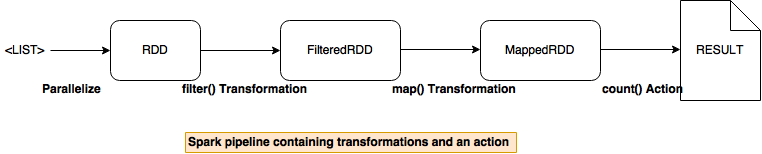
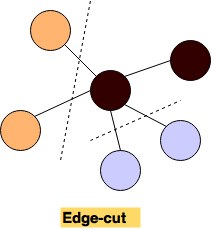
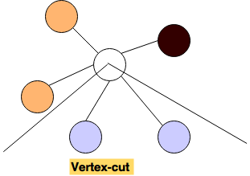
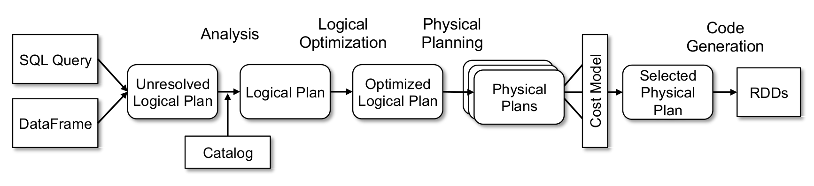

2015 NSDI Ousterhout
latency numbers that every programmer should know
## Outline
- 1. Programming Models
  - 1.1. Data parallelism: what is data parallelism and how do the following models relate to each other?
    - 1.1.1 MapReduce
    - 1.1.2 FlumeJava
    - 1.1.3 Dryad
    - 1.1.4 Spark
  - 1.2. Large-scale Parallelism on Graphs
    - Why a separate graph processing model? what is a BSP? working of BSP? Do not stress more since its not a map reduce world exactly.
    - GraphX programming model - discuss disadvantages graph-parallel model to data parallel model for large scale graph processing? how graphX combines the advantages of both the models? representation of a graph in GraphX?  discuss the model, vertex cut partitioning and its importance? graph operations ?

  - 1.3. Querying: we need more declarative interfaces, built on top MR models.
    - Sawzall : first one propose
    - Pig : on top of Hadoop, independent of execution platform, in theory can compiled into DryadLINQ too; what is the performance gain/lost? Easier to debug?   
    - Hive 
    - DryadLINQ: SQL-like, uses Dryad as execution engine;   
    `Suggestion: Merge this with Dryad above?`
    - Dremel, query natively w/o translating into MR jobs
    - Spark SQL  - Limitations of Relational alone models? how SparkSQL model overcomes it? goals of SparkSQL? how it leverages the Spark programming model? what is a DataFrame and how is it different from a RDD? what are the operations a DataFrame provides? how is in-memory caching different from Spark?

- 2. Execution Models
  - 2.1 MapReduce (intermediate writes to disk): What is the sequence of actions when a MapReduce functions are called? How is write-to-disk good/bad (fault-tolerant/slow)? How does the data are transmitted across clusters efficiently (store locally)? To shorten the total time for MR operations, it uses backup tasks. When MR jobs are pipelined, what optimizations can be performed by FlumeJava? In spite of optimizations and pipelining, what is the inherent limitation (not support iterative algorithm?)
  - 2.2 Spark (all in memory): introduce spark architecture, different layers, what happens when a spark job is executed? what is the role of a driver/master/worker, how does a scheduler schedule the tasks and what performance measures are considered while scheduling? how does a scheduler manage node failures and missing partitions? how are the user defined transformations passed to the workers? how are the RDDs stored and memory management measures on workers? do we need checkpointing at all given RDDs leverage lineage for recovery? if so why ?
  - 2.3 Graphs :
    - Pregel :Overview of Pregel. Its implementation and working. its limitations. Do not  stress more since we have a better model GraphX to explain a lot.
    - GraphX : Working on this.
  - SparkSQL Catalyst & Spark execution model : Discuss Parser, LogicalPlan, Optimizer, PhysicalPlan, Execution Plan. Why catalyst? how catalyst helps in SparkSQL , data flow from sql-core-> catalyst->spark-core

- Evaluation: Given same algorithm, what is the performance differences between Hadoop, Spark, Dryad? There are no direct comparison for all those models, so we may want to compare separately:
  - Hadoop vs. Spark
  - Spark vs. SparkSQL from SparkSQL paper

- Big Data Ecosystem   
  Everything interoperates with GFS or HDFS, or makes use of stuff like protocol buffers so systems like Pregel and MapReduce and even MillWheel...
  - GFS/HDFS for MapReduce/Hadoop: Machines are unreliable, how do they provide fault-tolerance? How does GFS deal with single point of failure (shadow masters)? How does the master manage partition, transmission of data chunks? Which
  - Resource Management: Mesos. New frameworks keep emerging and users have to use multiple different frameworks(MR, Spark etc.) in the same clusters, so how should they share access to the large datasets instead of costly replicate across clusters?
  - Introducing streaming: what happens when data cannot be complete? How does different programming model adapt? windowing `todo: more`

## 1 Programming Models
### 1.1 Data parallelism
*Data parallelism* is to run a single operation on different pieces of the data on different machines in parallel. Comparably, a sequential computation looks like *"for all elements in the dataset, do operation A"*, where dataset could be in the order of terabytes or petabytes aka. big data and one wants to scale up the processing. The challenges to do this sequential computation in a parallelized manner include how to abstract the different types of computations in a simple and correct way, how to distribute the data to hundreds/thousands of machines, how to handle failures and so on.

<figure class="main-container">
  
</figure>

*MapReduce*  is a programming model proposed by Google to initially satisfy their demand of large-scale indexing for web search service. It provides a simple user program interface: *map* and *reduce* functions and automatically handles the parallelization and distribution.

The MapReduce model is simple and powerful, and quickly became very popular among developers. However, when developers start writing real-world applications, they often end up chaining together MapReduce stages. The pipeline of MapReduce forces programmers to write additional coordinating codes, i.e. the development style goes backward from simple logic computation abstraction to lower-level coordination management. Besides, Developers mostly need to understand the execution model to do manual optimizations. *FlumeJava* library intends to provide support for developing data-parallel pipelines. It defers the evaluation, constructs an execution plan from parallel collections, optimizes the plan, and then executes underlying MR primitives. The optimized execution is comparable with hand-optimized pipelines, so there's no need to write raw MR programs directly.

Microsfot *Dryad*  designed differently from MapReduce and can support more general computations. It abstracts individual computation tasks as vertices, and constructs a communication graph between those vertices. What programmers need to do is to describe this DAG graph and let Dryad execution engine to construct the execution plan and manage scheduling and optimization. One of the advantages of Dryad over MapReduce is that Dryad vertices can process an arbitrary number of inputs and outputs, while MR only supports to a single input and a single output for each vertex.   Besides the flexibility of computations, Dryad also allows memory


Dryad expresses computation as acyclic data flows, which might be too expensive for some complex applications, e.g. iterative machine learning algorithms. *Spark*  is a framework that uses functional programming and pipelining to provide such support. It is largely inspired by MapReduce, however, instead of writing data to disk for each job as MapReduce does, user program in Spark can explicitly cache an RDD in memory and reuse the same dataset across multiple parallel operations. This feature makes Spark suitable for iterative jobs and interactive analytics.


Details about the programming models of MapReduce, FlumeJava, Dryad and Spark are discussed in following four sections.


### 1.1.1 MapReduce  
In this model, parallelizable computations are abstracted into map and reduce functions. The computation accepts a set of key/value pairs as input and produces a set of key/value pairs as output. The process involves two phases: *Map* and *Reduce*:
- *Map*, written by the user, accepts a set of key/value pairs("record") as input, applies *map* operation on each record, then it computes a set of intermediate key/value pairs as output.
- *Shuffle*, provided by MapReduce library, groups the all the intermediate values of the same key together and pass to *Reduce* function.
- *Reduce*, also written by the user, accepts an intermediate key and a set of values associated with that key, operate on them, produces zero or one output value.

Conceptually, the map and reduction functions have associated **types**:

\\[map (k1,v1) \rightarrow  list(k2,v2)\\]

\\[reduce (k2,list(v2)) \rightarrow list(v2)\\]


The input keys and values are drawn from a different domain than the output keys and values. The intermediate keys and values are from the same domain as the output keys and values.


Concretely, considering the problem of counting the number of occurrence of each word in a large collection of documents: each time, a `map` function that emits a word plus its count 1; a `reduce` function sums together all counts emitted for the same word

```
map(String key, String value):
  // key: document name
  // value: document contents
  for each word w in value:
    EmitIntermediate(w, "1");

reduce(String key, Iterator values):
  // key: a word
  // values: a list of counts
  int result = 0;
  for each v in values:
    result += ParseInt(v);
  Emit(AsString(result));
```

During executing, the MapReduce library assigns a master node to manage data partition and scheduling,  other nodes can serve as workers to run either *map* or *reduce* operations on demands. More details of the execution model is discussed later. Here, it's worth mentioning that the intermediate results are written into disks and reduce operation will read from disk. This is crucial for fault tolerance.

*Fault Tolerance*  
MapReduce runs on hundreds or thousands of unreliable commodity machines, so the library must provide fault tolerance. The library assumes that master node would not fail, and it monitors worker failures. If no status update is received from a worker on timeout, the master will mark it as failed. Then the master may schedule the associated task to other workers depending on task type and status. The commits of *map* and *reduce* task outputs are atomic, where the in-progress task writes data into private temporary files, once the task succeeds, it negotiate with the master and rename files to complete the task . In the case of failure, the worker discards those temporary files. This guarantees that if the computation is deterministic, the distribution implementation should produce same outputs as non-faulting sequential execution.

*Limitations* `TODO: re-organize`   
- It only works for batch processing jobs. More sophisticated applications are not easy to be abstracted as a set of map/reduce operations. In sum, it cannot work well for iterative, graph, or incremental processing.
- MR has to do I/O operation for each job and makes it too slow to support applications that require low latency. `TODO: FIX text and reference` Many a analytics workloads like K-means, logistic regression, graph processing applications like PageRank, shortest path using parallel breadth first search require multiple stages of map reduce jobs. In regular map reduce framework like Hadoop, this requires the developer to manually handle the iterations in the driver code. At every iteration, the result of each stage T is written to HDFS and loaded back again at stage T+1 causing a performance bottleneck. The reason being wastage of network bandwidth, CPU resources and mainly the disk I/O operations which are inherently slow. In order to address such challenges in iterative workloads on map reduce, frameworks like Haloop , Twister  and iMapReduce  adopt special techniques like caching the data between iterations and keeping the mapper and reducer alive across the iterations.
- The master is a single point of failure.
- Writing raw MR program still requires plentiful efforts from programmers, especially when real applications require a pipeline of MapReduce jobs and programmers have to write coordinate code to chain together those MR stages.

### 1.1.2 FlumeJava
FlumeJava was introduced to make it easy to develop, test, and run efficient data-parallel pipelines. FlumeJava represents each dataset as an object and transformation is invoked by using methods on these objects. It constructs an efficient internal execution plan from a pipeline of MapReduce jobs, uses deferred evaluation and optimizes based on plan structures. The debugging ability allows programmers to run on the local machine first and then deploy to large clusters.

*Core Abstraction*  
- `PCollection<T>`, a immutable bag of elements of type `T`
- `recordOf(...)`, specifies the encoding of the instance
- `PTable<K, V>`, a subclass of `PCollection<Pair<K,V>>`, a immutable multi-map with keys of type `K` and values of type `V`
- `parallelDo()`, can be expressed both the map and reduce parts of MapReduce
- `groupByKey()`, same as shuffle step of MapReduce
- `combineValues()`, semantically a special case of `parallelDo()`, a combination of a MapReduce combiner and a MapReduce reducer, which is more efficient than doing all the combining in the reducer.

*Deferred Evaluation*  
The state of each `PCollection` object is either *deferred* (not yet computed) and *materialized* (computed).

*Example*  
`TODO: example and explain the execution plan`
```Java
PCollection<String> words =
  lines.parallelDo(new DoFn<String,String>() {
    void process(String line, EmitFn<String> emitFn) {
      for (String word : splitIntoWords(line)) {
        emitFn.emit(word);
      }
    }
  }, collectionOf(strings()));
```

*Optimizer*  
`(JJ: placehoder) parallelDo Fusion; MSCR;  overall goal to produce the fewest, most efficient MSCR operations in the final optimized plan`


### 1.1.3 Dryad
Dryad is a more general and flexible execution engine that execute subroutines at a specified graph vertices. Developers can specify an arbitrary directed acyclic graph to combine computational "vertices" with communication channels (file, TCP pipe, shared-memory FIFO) and  build a dataflow graph. Compared with MapReduce, Dryad can specify an arbitrary DAG that have multiple number of inputs/outputs and support multiple stages. Also it can have more channels and boost the performance when using TCP pipes and shared-memory. But like writing a pipeline of MapReduce jobs, Dryad is a low-level programming model and hard for users to program, thus a more declarative model - DryadLINQ was created to fill in the gap. It exploits LINQ, a query language in .NET and automatically translates the data-parallel part into execution plan and passed to the Dryad execution engine.

### 1.1.4 Spark

Spark is a fast, in-memory data processing engine with an elegant and expressive development interface which enables developers to efficiently execute machine learning, SQL or streaming workloads that require fast iterative access to datasets. Its a functional style programming model (similar to DryadLINQ) where a developer can create acyclic data flow graphs and transform a set of input data through a map - reduce like operators. Spark provides two main abstractions - distributed in-memory storage (RDD) and parallel operations (based on Scala’s collection API) on data sets high performance processing, scalability and fault tolerance. 

***Distributed in-memory storage - Resilient Distributed Data sets :***

RDD is a partitioned, read only collection of objects which can be created from data in stable storage or by transforming other RDD. It can be distributed across multiple nodes (parallelize) in a cluster and is fault tolerant(Resilient). If a node fails, a RDD can always be recovered using its lineage graph (information on how it was derived from dataset). A RDD is stored in memory (as much as it can fit and rest is spilled to disk) and is immutable - It can only be transformed to a new RDD. These are the lazy transformations which are applied only if any action is performed on the RDD. Hence, RDD need not be materialized at all times.

The properties that power RDD with the above mentioned features :
- A list of dependencies on other RDD’s.
- An array of partitions that a dataset is divided into.
- A compute function to do a computation on partitions.
- Optionally, a Partitioner for key-value RDDs (e.g. to say that the RDD is hash-partitioned)
- Optional preferred locations (aka locality info), (e.g. block locations for an HDFS file)


<figure class="main-container">
  
</figure>


Spark API provide two kinds of operations on a RDD:

- Transformations - lazy operations that return another RDD.
  - `map (f : T => U) : RDD[T] ⇒ RDD[U]` : Return a MappedRDD[U] by applying function f to each element
  - `flatMap( f : T ⇒ Seq[U]) : RDD[T] ⇒ RDD[U]` : Return a new FlatMappedRDD[U] by first applying a function to all elements     and then flattening the results.
  - `filter(f:T⇒Bool) : RDD[T] ⇒ RDD[T]` : Return a FilteredRDD[T] having elemnts that f return true
  - `groupByKey()` : Being called on (K,V) Rdd, return a new RDD[([K], Iterable[V])]
  - `reduceByKey(f: (V, V) => V)` : Being called on (K, V) Rdd, return a new RDD[(K, V)] by aggregating values using eg: reduceByKey(_+_)
  - `join((RDD[(K, V)], RDD[(K, W)]) ⇒ RDD[(K, (V, W))]` :Being called on (K,V) Rdd, return a new RDD[(K, (V, W))] by joining them by key K.


- Actions - operations that trigger computation on a RDD and return values.

  - `reduce(f:(T,T)⇒T) : RDD[T] ⇒ T` : return T by reducing the elements using specified commutative and associative binary operator
  - `collect()` : Return an Array[T] containing all elements
  - `count()` : Return the number of elements

RDDs by default are discarded after use. However, Spark provides two explicit operations  persist() and cache() to ensure RDDs are persisted in memory once the RDD has been computed for the first time.

***Why RDD over Distributed Shared memory (DSM) ?***
RDDs are immutable and can only be created through coarse grained transformation while DSM allows fine grained read and write operations to each memory location. Hence RDDs do not incur the overhead of checkpointing thats present in DSM and can be recovered using their lineages.
RDDs are immutable and hence a straggler(slow node) can be replaced with backup copy as in Map reduce. This is hard to implement in DSM as two copies point to the same location and can interfere in each other’s update.
Other benefits include the scheduling of tasks based on data locality to improve performance and the ability of the RDDs to degrade gracefully incase of memory shortage. Partitions that do not fit in RAM gets spilled to the disk (performance will then be equal to that of any data parallel system).

***Challenges in Spark***

- `Functional API semantics` : The GroupByKey operator is costly in terms of performance. In that it returns a distributed collection of (key, list of value) pairs to a single machine and then an aggregation on individual keys is performed on the same machine resulting in computation overhead. Spark does provide reduceByKey operator which does a partial aggregation on invidual worker nodes before returning the distributed collection. However, developers who are not aware of such a functionality can unintentionally choose groupByKey.

- `Debugging and profiling` : There is no availability of debugging tools and developers find it hard to realize if a computation is happening more on a single machine or if the data-structure they used were inefficient.


### 1.2 Large-scale Parallelism on Graphs
Map Reduce doesn’t scale easily and is highly inefficient for iterative / graph algorithms like page rank and machine learning algorithms. Iterative algorithms requires programmer to explicitly handle the intermediate results (writing to disks). Hence, every iteration requires reading the input file and writing the results to the disk resulting in high disk I/O which is a performance bottleneck for any batch processing system.

Also graph algorithms require exchange of messages between vertices. In case of PageRank, every vertex requires the contributions from all its adjacent nodes to calculate its score. Map reduce currently lacks this model of message passing which makes it complex to reason about graph algorithms. One model that is commonly employed for implementing distributed graph processing is the graph parallel model.

In the graph-parallel abstraction, a user-defined vertex program is instantiated concurrently for each vertex and interacts with adjacent vertex programs through messages or shared state. Each vertex program can read and modify its vertex property and in some cases adjacent vertex properties. When all vertex programs vote to halt the program terminates. Most systems adopt the bulk synchronous parallel model

This model was introduced in 1980 to represent the hardware design features of parallel computers. It gained popularity as an alternative for map reduce since it addressed the above mentioned issues with map reduce<br />
BSP model is a message passing synchronous model where -

 - Computation consists of several steps called as supersets.
 - The processors involved have their own local memory and every processor is connected to other via a point-to-point communication.
 - At every superstep, a processor receives input at the beginning, performs computation and outputs at the end.
 - A processor at superstep S can send message to another processor at superstep S+1 and can as well receive message from superstep S-1.
 - Barrier synchronization synchs all the processors at the end of every superstep.

A notable feature of the model is the complete control on data through communication between every processor at every superstep. Though similar to map reduce model, BSP preserves data in memory across supersteps and helps in reasoning iterative graph algorithms.

The graph-parallel abstractions allow users to succinctly describe graph algorithms, and provide a runtime engine to execute these algorithms in a distributed nature. They simplify the design, implementation, and application of sophisticated graph algorithms to large-scale real-world problems. Each of these frameworks presents a different view of graph computation, tailored to an originating domain or family of graph algorithms. However, these frameworks fail to address the problems of data preprocessing and construction, favor snapshot recovery over fault tolerance and lack support from distributed data flow frameworks. The data-parallel systems are well suited to the task of graph construction, and are highly scalable. However, suffer from the very problems mentioned before for which the graph-parallel systems came into existence.
GraphX is a new computation system which builds upon the Spark’s Resilient Distributed Dataset (RDD) to form a new abstraction Resilient Distributed Graph (RDG) to represent records and their relations as vertices and edges respectively. RDG’s leverage the RDD’s fault tolerance mechanism and expressivity.

How does GraphX improve over the existing graph-parallel and data flow models ?
The RDGs in GraphX provides a set of elegant and expressive computational primitives through which  many a graph parallel systems like Pregel, PowerGraph can be easily expressed with minimal lines of code. GraphX simplifies the process of graph ETL and analysis through new operations like filter, view and graph transformations. It minimizes communication and storage overhead.

Similar to the data flow model, it GraphX away from the vertex centric view and adopts transformations on graphs yielding a new graph.

***Why partitioning is important in graph computation systems ?***
Graph-parallel computation requires every vertex or edge to be processed in the context of its neighborhood. Each transformation depends on the result of distributed joins between vertices and edges. This means that graph computation systems rely on graph partitioning (edge-cuts in most of the systems) and efficient storage to minimize communication and storage overhead and ensure balanced computation.

<figure class="main-container">
  
</figure>

***Why Edge-cuts are expensive ?***
Edge-cuts for partitioning requires random assignment of vertices and edges across all the machines. hus the communication and storage overhead is proportional to the number of edges cut, and this makes balancing the number of cuts a priority. For most real-world graphs, constructing an optimal edge-cut is cost prohibitive, and most systems use random edge-cuts which achieve appropriate work balance, but nearly worst-case communication overhead. 

<figure class="main-container">
  
</figure>

***Vertex-cuts - GraphX’s solution to effective partitioning*** : An alternative approach which does the opposite of edge-cut — evenly assign edges to machines, but allow vertices to span multiple machines. The communication and storage overhead of a vertex-cut is directly proportional to the sum of the number of machines spanned by each vertex. Therefore, we can reduce communication overhead and ensure balanced computation by evenly assigning edges to machines in way that minimizes the number of machines spanned by each vertex.

The GraphX RDG structure implements a vertex-cut representation of a graph using three unordered horizontally partitioned RDD tables. These three tables are gone into in more detail in the paper, but the general purposes are as follows:

- `EdgeTable(pid, src, dst, data)`: Stores adjacency structure and edge data.
-  `VertexDataTable(id, data)`: Stores vertex data. Contains states associated with vertices that are changing in the course of graph computation
- `VertexMap(id, pid)`: Maps from vertex ids to the partitions that contain their adjacent edges. Remains static as long as the graph structure doesn’t change.
	
A three-way relational join is used to bring together source vertex data, edge data, and target vertex data. The join is straightforward, and takes advantage of a partitioner to ensure the join site is local to the edge table. This means GraphX only has to shuffle vertex data.

***Operators in GraphX***
Other than standard data-parallel operators like filter, map, leftJoin, and reduceByKey, GraphX supports following graph-parallel operators:

- graph - constructs property graph given a collection of edges and vertices.
- vertices, edges - decompose the graph into a collection of vertices or edges by extracting vertex or edge RDDs.
- mapV, mapE - transform the vertex or edge collection.
- triplets -returns collection of form ((i, j), (PV(i), PE(i, j), PV(j))). The operator essentially requires a multiway join between vertex and edge RDD. This operation is optimized by shifting the site of joins to edges, using the routing table, so that only vertex data needs to be shuffled.
- leftJoin - given a collection of vertices and a graph, returns a new graph which incorporates the property of matching vertices from the given collection into the given graph without changing the underlying graph structure.
- subgraph - returns a subgraph of the original graph by applying predicates on edges and vertices
- mrTriplets (MapReduce triplet) - logical composition of triplets followed by map and reduceByKey. It is the building block of graph-parallel algorithms.


### 1.3 Querying


#### SparkSQL - Where Relational meets Procedural :
Relational interface to big data is good, however, it doesn’t cater to users who want to perform

- ETL to and from various semi or unstructured data sources.
- advanced analytics like machine learning or graph processing.

These user actions require best of both the worlds - relational queries and procedural algorithms. Spark SQL bridges this gap by letting users to seamlessly intermix both relational and procedural API.

Hence, the major contributions of Spark SQL are the Dataframe API and the Catalyst. Spark SQL intends to provide relational processing over native RDDs and on several external data sources, through a programmer friendly API, high performance through DBMS techniques, support semi-structured data and external databases, support for advanced analytical processing like machine learning algorithms and graph processing.

***Programming API***

Spark SQL runs on the top of Spark providing SQL interfaces. A user can interact with this interface though JDBC/ODBC, command line or Dataframe API.
A Dataframe API lets users to intermix both relational and procedural code with ease. Dataframe is a collection of schema based rows of data and named columns on which relational operations can be performed with optimized execution. Unlike a RDD, Dataframe allows developers to define structure for the data and can be related to tables in a relational database or R/Python’s Dataframe. Dataframe can be constructed from tables of external sources or existing native RDD’s. Dataframe is lazy and each object in it represents a logical plan which is not executed until an output operation like save or count is performed.
Spark SQL supports all the major SQL data types including complex data types like arrays, maps and unions.
Some of the Dataframe operations include projection (select), filter(where), join and aggregations(groupBy).
Illustrated below is an example of relational operations on employees data frame to compute the number of female employees in each department.

```
employees.join(dept, employees("deptId") === dept("id")) .where(employees("gender") === "female") .groupBy(dept("id"), dept("name")) .agg(count("name"))
```
Several of these operators like  === for equality test, > for greater than, a rithmetic ones (+, -, etc) and aggregators transforms to a abstract syntax tree of the expression which can be passed to Catalyst for optimization.
A cache() operation on the data frame helps Spark SQL store the data in memory so it can be used in iterative algorithms and for interactive queries. In case of Spark SQL, memory footprint is considerably less as it applies columnar compression schemes like dictionary encoding / run-length encoding.

The DataFrame API also supports inline UDF definitions without complicated packaging and registration. Because UDFs and queries are both expressed in the same general purpose language (Python or Scala), users can use standard debugging tools.

However, a DataFrame lacks type safety. In the above example, attributes are referred to by string names. Hence, it is not possible for the compiler to catch any errors. If attribute names are incorrect then the error will only detected at runtime, when the query plan is created.
Spark introduced a extension to Dataframe called ***Dataset*** to provide this compile type safety. It embraces object oriented style for programming and has an additional feature termed Encoders. Encoders translate between JVM representations (objects) and Spark’s internal binary format. Spark has built-in encoders which are very advanced in that they generate byte code to interact with off-heap data and provide on-demand access to individual attributes without having to de-serialize an entire object


Winding up - we can compare SQL vs Dataframe vs Dataset as below :

<figure class="main-container">
  
</figure>


## 2 Execution Models
**2.1 MapReduce**,   
as mentioned in the programming model section, the execution model is interesting that all the intermediate key/value pairs are written to and read from disk. The output from distributed computation should be same as one from non-faulting sequential execution of the entire program. And the model relies on the atomic commits of map and reduce task outputs to achieve it. The basic idea is to create private temporary files and rename them only when the task has finished. This makes fault-tolerance easy, one could simple start another one if the worker failed. But this is also the bottleneck to run multiple stages.

*Execution*  `TODO: move this to execution and talk about fault-tolerance instead`
At high level, when the user program calls *MapReduce* function, the input files are split into *M* pieces and it runs *map* function on corresponding splits; then intermediate key space are partitioned into *R* pieces using a partitioning function; After the reduce functions all successfully complete, the output is available in *R* files. The sequences of actions are shown in the figure below. We can see from label (4) and (5) that the intermediate key/value pairs are written/read into disks, this is a key to fault-tolerance in MapReduce model and also a bottleneck for more complex computation algorithms.  

<figure class="main-container">
  
</figure>


**Pregel**

Pregel is an implementation of classic BSP model by Google (PageRank) to analyze large graphs exclusively. It was followed by open source implementations - Apache’s Giraph and Hama; which were BSP models built on top of Hadoop.

Pregel is highly scalable, fault-tolerant and can successfully represent larger complex graphs. Google claims the API becomes easy once a developer adopts “think like a vertex” mode.
Pregel’s computation system is iterative and every iteration is called as superstep. The system takes a directed graph as input with properties assigned to both vertices and graph. At each superstep, all vertices executes in parallel, a user-defined function which represents the behavior of the vertex. The function has access to message sent to its vertex from the previous superstep S-1 and can update the state of the vertex, its edges, the graph and even send messages to other vertices which would receive in the next superstep S+1. The synchronization happens only between two supersteps.  Every vertex is either active or inactive at any superstep. The iteration stops when all the vertices are inactive. A vertex can deactivate itself by voting for it and gets active if it receives a message. This asynchronous message passing feature eliminates the shared memory, remote reads and latency of Map reduce model.

Pregel’s API provides

- compute() method for the user to implement the logic to change the state of the graph/vertex at every superstep. It guarantees message delivery through an iterator at every superstep.
- User defined handler for handling issues like missing destination vertex etc.
- Combiners reduce the amount of messages passed from multiple vertices to the same destination vertex.
- Aggregators capture the global state of the graph. A reduce operation combines the value given by every vertex to the aggregator. The combined/aggregated value is passed onto to all the vertices in the next superstep.
- Fault tolerance is achieved through checkpointing and instructing the workers to save the state of nodes to a persistent storage. When a machine fails, all workers restart the execution with state of their recent checkpoint.
- Master and worker implementation : The master partitions graph into set of vertices (hash on vertex ID mod number of partitions) and outgoing edges per partition. Each partition is assigned to a worker who manages the state of all its vertices by executing compute() method and coordinating the message communication. The workers also notifies the master of the vertices that are active for the next superstep.

Pregel works good for sparse graphs. However, dense graph could cause communication overhead resulting in system to break. Also, the entire computation state resides in the main memory and hence constrained by the size of main memory.

Apache Giraph is an open source implementation of Pregel in which new features like master computation, sharded aggregators, edge-oriented input, out-of-core computation are added making it more efficient.  The most high performance graph processing framework is GraphLab which is developed at Carnegie Melon University and uses the BSP model and executes on MPI.

**Spark execution model**

<figure class="main-container">
  
</figure>

The Spark driver defines SparkContext which is the entry point for any job that defines the environment/configuration and the dependencies of the submitted job. It connects to the cluster manager and requests resources for further execution of the jobs.
The cluster manager manages and allocates the required system resources to the Spark jobs. Furthermore, it coordinates and keeps track of the live/dead nodes in a cluster. It enables the execution of jobs submitted by the driver on the worker nodes (also called Spark workers) and finally tracks and shows the status of various jobs running by the worker nodes.
A Spark worker executes the business logic submitted by the Spark driver. Spark workers are abstracted and are allocated dynamically by the cluster manager to the Spark driver for the execution of submitted jobs. The driver will listen for and accept incoming connections from its executors throughout its lifetime.

***Job scheduler optimization :*** Spark’s job scheduler tracks the persistent RDD’s saved in memory. When an action (count or collect) is performed on a RDD, the scheduler first analyzes the lineage graph to build a DAG of stages to execute. These stages only contain the transformations having narrow dependencies. Outside these stages are the wider dependencies for which the scheduler has to fetch the missing partitions from other workers in order to build the target RDD. The job scheduler is highly performant. It assigns tasks to machines based on data locality or to the preferred machines in the contained RDD. If a task fails, the scheduler re-runs it on another node and also recomputes the stage’s parent is missing.

***How are persistent RDD’s memory managed ?***

Persistent RDDs are stored in memory as java objects (for performance) or in memory as serialized data (for less memory usage at cost of performance) or on disk. If the worker runs out of memory upon creation of a new RDD, LRU policy is applied to evict the least recently accessed RDD unless its same as the new RDD. In that case, the old RDD is excluded from eviction given the fact that it may be reused again in future. Long lineage chains involving wide dependencies are checkpointed to reduce the time in recovering a RDD. However, since RDDs are read-only, checkpointing is still ok since consistency is not a concern and there is no overhead to manage the consistency as is seen in distributed shared memory.


**SparkSQL execution model**

SparkSQL execution model leverages Catalyst framework for optimizing the SQL before submitting it to the Spark Core engine for scheduling the job.
A Catalyst is a query optimizer. Query optimizers for map reduce frameworks can greatly improve performance of the queries developers write and also significantly reduce the development time. A good query optimizer should be able to optimize user queries, extensible for user to provide information about the data and even dynamically include developer defined specific rules.

Catalyst leverages the Scala’s functional language features like pattern matching and runtime meta programming to allow developers to concisely specify complex relational optimizations.

Catalyst includes both rule-based and cost-based optimization. It is extensible to include new optimization techniques and features to Spark SQL and also let developers provide data source specific rules.
Catalyst executes the rules on its data type Tree - a composition of node objects where each node has a node type (subclasses of TreeNode class in Scala) and zero or more children. Node objects are immutable and can be manipulated. The transform method of a Tree applies pattern matching to match a subset of all possible input trees on which the optimization rules needs to be applied.

Hence, in Spark SQL, transformation of user queries happens in four phases :

<figure class="main-container">
  
</figure>

***Analyzing a logical plan to resolve references :*** In the analysis phase a relation either from the abstract syntax  tree (AST) returned by the SQL parser or from a DataFrame is analyzed to create a logical plan out of it, which is still unresolved (the columns referred may not exist or may be of wrong datatype). The logical plan is resolved using using the Catalyst’s Catalog object(tracks the table from all data sources) by mapping the named attributes to the input provided, looking up the relations by name from catalog, by propagating and coercing types through expressions.

***Logical plan optimization :*** In this phase, several of the rules like constant folding, predicate push down, projection pruning, null propagation, boolean expression simplification are applied on the logical plan.

***Physical planning :*** In this phase, Spark generates multiples physical plans out of the input logical plan and chooses the plan based on a cost model. The physical planner also performs rule-based physical optimizations, such as pipelining projections or filters into one Spark map operation. In addition, it can push operations from the logical plan into data sources that support predicate or projection pushdown.


***Code Generation :*** The final phase generates the Java byte code that should run on each machine.Catalyst transforms the Tree which is an expression in SQL to an AST for Scala code to evaluate, compile and run the generated code. A special scala feature namely quasiquotes aid in the construction of abstract syntax tree(AST).

## Performance
`TODO: re-organize` There are some practices in this paper that make the model work very well in Google, one of them is **backup tasks**: when a MapReduce operation is close to completion, the master schedules backup executions of the remaining in-progress tasks ("straggler"). The task is marked as completed whenever either the primary or the backup execution completes.
In the paper, the authors measure the performance of MapReduce on two computations running on a large cluster of machines. One computation *grep* through approximately 1TB of data. The other computation *sort* approximately 1TB of data. Both computations take in the order of a hundred seconds. In addition, the backup tasks do help largely reduce execution time. In the experiment where 200 out of 1746 tasks were intentionally killed, the scheduler was able to recover quickly and finish the whole computation for just a 5% increased time.  
Overall, the performance is very good for conceptually unrelated computations.


## Things people are building on top of MapReduce/Spark
  - FlumeJava? ...Etc
  - Ecosystem, everything interoperates with GFS or HDFS, or makes use of stuff like protocol buffers so systems like Pregel and MapReduce and even MillWheel...

## References



## Trash


## Iterative processing in Map Reduce

Many a analytics workloads like K-means, logistic regression, graph processing applications like PageRank, shortest path using parallel breadth first search require multiple stages of map reduce jobs. In regular map reduce framework like Hadoop, this requires the developer to manually handle the iterations in the driver code. At every iteration, the result of each stage T is written to HDFS and loaded back again at stage T+1 causing a performance bottleneck. The reason being wastage of network bandwidth, CPU resources and mainly the disk I/O operations which are inherently slow. In order to address such challenges in iterative workloads on map reduce, frameworks like Haloop, Twister and iMapReduce adopt special techniques like caching the data between iterations and keeping the mapper and reducer alive across the iterations.


**Haloop** : 

**iMapReduce**: 

**Twister** :  

## Map Reduce inspired large scale data processing systems

**Dryad/DryadLinq** :

**Spark (big one)** :

## Declarative interfaces for the Map Reduce framework
Map reduce provides only two high level primitives - map and reduce; that the programmers have to worry about. Map reduce takes care of all the processing over a cluster, failure and recovery, data partitioning etc. However, the framework still suffers from rigidity with respect to its one-input data format (key/value pair) and two-stage data flow. Several important patterns like joins (which could be highly complex depending on the data) are extremely hard to implement and reason about for a programmer. Sometimes the code could be become repetitive  when the programmer wants to implement most common operations like projection, filtering etc.
Non-programmers like data scientists would highly prefer SQL like interface over a cumbersome and rigid framework. Such a high level declarative language can easily express their task while leaving all of the execution optimization details to the backend engine. Also, these kind of abstractions provide ample opportunities for query optimizations.

**Introduce Sazwal** (its now no more used but one of the first ideas) : Parallel analysis with Sawzall. Scientific Programming, 13(4):277–298, 2005

** FlumeJava (2010) **

Many real-world computations involves a pipeline of MapReduces, and this motivates additional management to chain together those separate MapReduce stages in an efficient way. FlumeJava  can help build those pipelines and keep computations modular. At core, FlumeJava are a couple of classes that represent immutable parallel collections. It defers evaluation and optimization by internally constructing an execution plan dataflow graph.

***Core Abstraction***

- `PCollection<T>`, a immutable bag of elements of type `T`
- `recordOf(...)`, specifies the encoding of the instance
- `PTable<K, V>`, a subclass of `PCollection<Pair<K,V>>`, a immutable multi-map with keys of type `K` and values of type `V`
- `parallelDo()`, can be expressed both the map and reduce parts of MapReduce
- `groupByKey()`, same as shuffle step of MapReduce `JJ: clear this in MapReduce`
- `combineValues()`, semantically a special case of `parallelDo()`, a combination of a MapReduce combiner and a MapReduce reducer, which is more efficient than doing all the combining in the reducer.

***Deferred Evaluation***
`(JJ: placehoder) join, deferred/materialized; execution plan; figure 1 initial execution plan`

***Optimizer***  
`(JJ: placehoder) parallelDo Fusion; MSCR;  overall goal to produce the fewest, most efficient MSCR operations in the final optimized plan`


//[`COMMENT: move this to introducing DryadLINQ`] Like MR, writing raw Dryad is hard, programmers need to understand system resources and other lower-level details. This motivates a more declarative programming model: DryadLINQ as a querying language.
