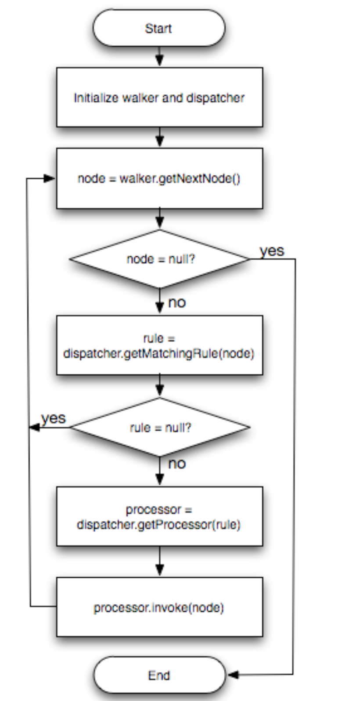
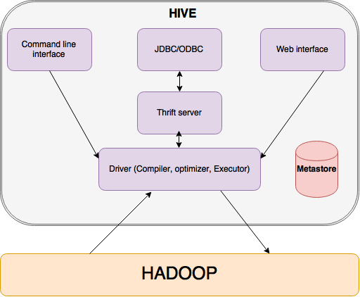
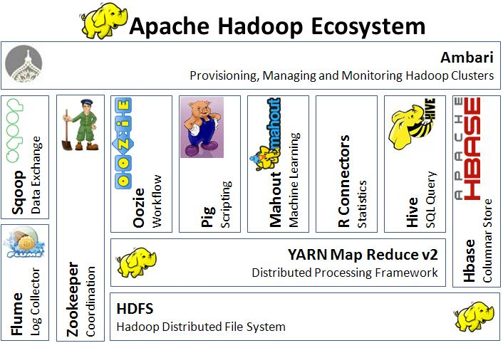
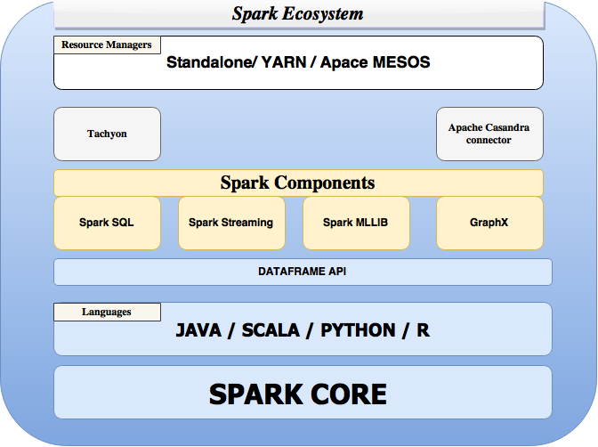

## Introduction
The growth of Internet has generated the so-called big data(terabytes or petabytes). It is not possible to fit them into a single machine or process them with one single program. Often the computation has to be done fast enough to provide practical services. A common approach taken by tech giants like Google, Yahoo, Facebook is to process big data across clusters of commodity machines. Many of the computations are conceptually straightforward, and Google proposed the MapReduce model to abstract the logic and proved to be simple and powerful. From then on, the idea inspired lots of other programming models. In this chapter, we will present how programming models evolve over time, why their execution engines are designed in certain ways, and underlying ecosystem that supports each developing thread.
## 1 Programming Models
### 1.1 Data parallelism
*Data parallelism* is, given a dataset, the simultaneous execution on multiple machines or threads of the same function across groups of elements of a dataset. Data parallelism can also be thought of as a subset of SIMD ("single instruction, multiple data") execution, a class of parallel execution in Flynn's taxonomy. Comparably, a sequential computation looks like *"for all elements in the dataset, do operation A"*, where dataset could be in the order of terabytes or petabytes aka. big data and one wants to scale up the processing. The challenges to do this sequential computation in a parallelized manner include how to abstract the different types of computations in a simple and correct way, how to distribute the data to hundreds/thousands of machines, how to handle failures and so on.

<figure class="main-container">
  
</figure>

**MapReduce**  is a programming model proposed by Google to initially satisfy their demand of large-scale indexing for web search service. It provides a simple user program interface: *map* and *reduce* functions and automatically handles the parallelization and distribution.

The MapReduce model is simple and powerful, and quickly became very popular among developers. However, when developers start writing real-world applications, they often end up chaining together MapReduce stages. The pipeline of MapReduce forces programmers to write additional coordinating codes, i.e. the development style goes backward from simple logic computation abstraction to lower-level coordination management. In map reduce, programmers need to reason about data representation on disk or in storage services such as a database. Besides, developers need to clearly understand the map reduce execution model  to do manual optimizations[ref]. **FlumeJava**  library intends to provide support for developing data-parallel pipelines by abstracting away the complexity involved in data representation and implicitly handling the optimizations. It defers the evaluation, constructs an execution plan from parallel collections, optimizes the plan, and then executes underlying MR primitives. The optimized execution is comparable with hand-optimized pipelines, so there's no need to write raw MR programs directly.

An alternative approach to data prallelism is to construct complex, multi-step directed acyclic graphs (DAGs) of work from the user instructions and execute those DAGs all at once. This eliminates the costly synchronization required by MapReduce and makes applications much easier to build and reason about. Dryad, a Microsoft Research project used internally at Microsoft was one such project which leveraged this model of computation.

Microsfot **Dryad**  abstracts individual computational tasks as vertices, and constructs a communication graph between those vertices. What programmers need to do is to describe this DAG graph and let Dryad execution engine construct the execution plan and manage scheduling and optimization. One of the advantages of Dryad over MapReduce is that Dryad vertices can process an arbitrary number of inputs and outputs, while MR only supports a single input and a single output for each vertex. Besides the flexibility of computations, Dryad also supports different types of communication channel: file, TCP pipe and shared-memory FIFO.


Dryad expresses computation as acyclic data flows, which might be too expensive for some complex applications, e.g. iterative machine learning algorithms. **Spark**  is a framework that uses functional programming and pipelining to provide such support. It is largely inspired by MapReduce's model and builds upon the ideas behind DAG, lazy evaluation of DryadLinq. Instead of writing data to disk for each job as MapReduce does Spark can cache the results across jobs. Spark explicitly caches computational data in memory thorugh specialized immutable datasets named Resilient Distributed Sets(RDD) and reuse the same dataset across multiple parallel operations. The Spark builds upon RDD to achieve fault tolerance by reusing the lineage information of the lost RDD. This results in lesser overhead than what is seen in fault tolerance achieved by checkpoint in Distribtued Shared Memory systems. Moreover, Spark is the underlying framework upon which many very different systems are built, e.g., Spark SQL & DataFrames, GraphX, Streaming Spark, which makes it easy to mix and match the use of these systems all in the same application. These feature makes Spark the best fit for iterative jobs and interactive analytics and also helps it in providing better performance.

Above all, any system can be easily expressed by Spark enabling other models to leverage the specific advantages of Spark systems and still retain the process of computation without any changes to Spark system[ref].


Following four sections discuss about the programming models of MapReduce, FlumeJava, Dryad and Spark.


### 1.1.1 MapReduce  
In this model, parallelizable computations are abstracted into map and reduce functions. The computation accepts a set of key/value pairs as input and produces a set of key/value pairs as output. The process involves two phases:
- *Map*, written by the user, accepts a set of key/value pairs("record") as input, applies *map* operation on each record, then it computes a set of intermediate key/value pairs as output.
- *Reduce*, also written by the user, accepts an intermediate key and a set of values associated with that key, operate on them, produces zero or one output value.  
  Note: there is a *Shuffle* phase between *map* and *reduce*, provided by MapReduce library, groups the all the intermediate values of the same key together and pass to *Reduce* function. We will discuss more in Section 2 Execution Models.

Conceptually, the map and reduction functions have associated **types**:

\\[map (k1,v1) \rightarrow  list(k2,v2)\\]

\\[reduce (k2,list(v2)) \rightarrow list(v2)\\]


The input keys and values are drawn from a different domain than the output keys and values. The intermediate keys and values are from the same domain as the output keys and values.


Concretely, considering the problem of counting the number of occurrence of each word in a large collection of documents: each time, a `map` function that emits a word plus its count 1; a `reduce` function sums together all counts emitted for the same word

```
map(String key, String value):
  // key: document name
  // value: document contents
  for each word w in value:
    EmitIntermediate(w, "1");

reduce(String key, Iterator values):
  // key: a word
  // values: a list of counts
  int result = 0;
  for each v in values:
    result += ParseInt(v);
  Emit(AsString(result));
```

During executing, the MapReduce library assigns a master node to manage data partition and scheduling,  other nodes can serve as workers to run either *map* or *reduce* operations on demands. More details of the execution model is discussed later. Here, it's worth mentioning that the intermediate results are written into disks and reduce operation will read from disk. This is crucial for fault tolerance.

*Fault Tolerance*  
MapReduce runs on hundreds or thousands of unreliable commodity machines, so the library must provide fault tolerance. The library assumes that master node would not fail, and it monitors worker failures. If no status update is received from a worker on timeout, the master will mark it as failed. Then the master may schedule the associated task to other workers depending on task type and status. The commits of *map* and *reduce* task outputs are atomic, where the in-progress task writes data into private temporary files, once the task succeeds, it negotiate with the master and rename files to complete the task . In the case of failure, the worker discards those temporary files. This guarantees that if the computation is deterministic, the distribution implementation should produce same outputs as non-faulting sequential execution.

*Limitations*  
Many a analytics workloads like K-means, logistic regression, graph processing applications like PageRank, shortest path using parallel breadth first search require multiple stages of map reduce jobs. In regular map reduce framework like Hadoop, this requires the developer to manually handle the iterations in the driver code. At every iteration, the result of each stage T is written to HDFS and loaded back again at stage T+1 causing a performance bottleneck. The reason being wastage of network bandwidth, CPU resources and mainly the disk I/O operations which are inherently slow. In order to address such challenges in iterative workloads on map reduce, frameworks like Haloop , Twister  and iMapReduce  adopt special techniques like caching the data between iterations and keeping the mapper and reducer alive across the iterations.

### 1.1.2 FlumeJava
FlumeJava was introduced to make it easy to develop, test, and run efficient data-parallel pipelines. FlumeJava represents each dataset as an object and transformation is invoked by applying methods on these objects. It constructs an efficient internal execution plan from a pipeline of MapReduce jobs, uses deferred evaluation and optimizes based on plan structures. The debugging ability allows programmers to run on the local machine first and then deploy to large clusters.

*Core Abstraction*  
- `PCollection<T>`, a immutable bag of elements of type `T`, it can be created from in-memory Java `Collection<T>` or from reading a file with encoding specified by `recordOf`.
- `recordOf(...)`, specifies the encoding of the instance
- `PTable<K, V>`, a subclass of `PCollection<Pair<K,V>>`, a immutable multi-map with keys of type `K` and values of type `V`
- `parallelDo()`, can be expressed both the map and reduce parts of MapReduce
- `groupByKey()`, same as shuffle step of MapReduce
- `combineValues()`, semantically a special case of `parallelDo()`, a combination of a MapReduce combiner and a MapReduce reducer, which is more efficient than doing all the combining in the reducer.
- `flatten`, takes a list of `PCollection<T>`s and returns a single logic `PCollection<T>`.

For example: `todo: explain the code`
```!Java
PTable<String,Integer> wordsWithOnes =
  words.parallelDo(
      new DoFn<String, Pair<String,Integer>>() {
    void process(String word,
                 EmitFn<Pair<String,Integer>> emitFn) {
      emitFn.emit(Pair.of(word, 1));
    }
  }, tableOf(strings(), ints()));
PTable<String,Collection<Integer>>
  groupedWordsWithOnes = wordsWithOnes.groupByKey();
PTable<String,Integer> wordCounts =
  groupedWordsWithOnes.combineValues(SUM_INTS);
```

*Deferred Evaluation & Optimizer*  
One of the merits of using FlumeJava to pipeline MapReduce jobs is that it enables optimization automatically, by executing parallel operations lazily using *deferred evaluation*. The state of each `PCollection` object is either *deferred* (not yet computed) and *materialized* (computed). When the program invokes a *parallelDo()*, it creates an operation pointer to the actual deferred operation object. These operations form a directed acyclic graph called execution plan. The execution plan doesn't get evaluated until *run()* is called. This will cause optimization of the execution plan and evaluation in forward topological order. These optimization for transferring the modular execution plan into an efficient one include:
- parallelDo Fusion: $$f(g(x)) => f \circ g(x)$$. This can reduce steps
- MapShuffleCombineReduce (MSCR) Operation: combination of ParallelDo, GroupByKey, CombineValues and Flatten into one MapReduce job. This extends MapReduce to accept multiple inputs and multiple outputs. `todo: example of Figure 3`
  <figure class="main-container">
  
</figure>


### 1.1.3 Dryad
Dryad is a more general and flexible execution engine that execute subroutines at a specified graph vertices. Developers can specify an arbitrary directed acyclic graph to combine computational "vertices" with communication channels (file, TCP pipe, shared-memory FIFO) and  build a dataflow graph. Compared with MapReduce, Dryad can specify an arbitrary DAG that have multiple number of inputs/outputs and support multiple stages. Also it can have more channels and boost the performance when using TCP pipes and shared-memory. But like writing a pipeline of MapReduce jobs, Dryad is a low-level programming model and hard for users to program, thus a more declarative model - DryadLINQ   was created to fill in the gap. It exploits LINQ, a query language in .NET and automatically translates the data-parallel part into execution plan and passed to the Dryad execution engine. Like MR, writing raw Dryad is hard, programmers need to understand system resources and other lower-level details. This motivates a more declarative programming model: DryadLINQ - a querying language.

### 1.1.4 Spark

Spark   is a fast, in-memory data processing engine with an elegant and expressive development interface which enables developers to efficiently execute machine learning, SQL or streaming workloads that require fast iterative access to datasets. Its a functional style programming model (similar to DryadLINQ) where a developer can create acyclic data flow graphs and transform a set of input data through a map - reduce like operators. Spark provides two main abstractions - distributed in-memory storage (RDD) and parallel operations (based on Scala’s collection API) on data sets high performance processing, scalability and fault tolerance. 

*Distributed in-memory storage - Resilient Distributed Data sets :*

RDD is a partitioned, read only collection of objects which can be created from data in stable storage or by transforming other RDD. It can be distributed across multiple nodes (parallelize) in a cluster and is fault tolerant(Resilient). If a node fails, a RDD can always be recovered using its lineage graph (information on how it was derived from dataset). A RDD is stored in memory (as much as it can fit and rest is spilled to disk) and is immutable - It can only be transformed to a new RDD. These are the lazy transformations which are applied only if any action is performed on the RDD. Hence, RDD need not be materialized at all times.

The properties that power RDD with the above mentioned features :
- A list of dependencies on other RDD’s.
- An array of partitions that a dataset is divided into.
- A compute function to do a computation on partitions.
- Optionally, a Partitioner for key-value RDDs (e.g. to say that the RDD is hash-partitioned)
- Optional preferred locations (aka locality info), (e.g. block locations for an HDFS file)


<figure class="main-container">
  
</figure>


Spark API provide two kinds of operations on a RDD:

- Transformations - lazy operations that return another RDD.
  - `map (f : T => U) : RDD[T] ⇒ RDD[U]` : Return a MappedRDD[U] by applying function f to each element
  - `flatMap( f : T ⇒ Seq[U]) : RDD[T] ⇒ RDD[U]` : Return a new FlatMappedRDD[U] by first applying a function to all elements     and then flattening the results.
  - `filter(f:T⇒Bool) : RDD[T] ⇒ RDD[T]` : Return a FilteredRDD[T] having elemnts that f return true
  - `groupByKey()` : Being called on (K,V) Rdd, return a new RDD[([K], Iterable[V])]
  - `reduceByKey(f: (V, V) => V)` : Being called on (K, V) Rdd, return a new RDD[(K, V)] by aggregating values using eg: reduceByKey(_+_)
  - `join((RDD[(K, V)], RDD[(K, W)]) ⇒ RDD[(K, (V, W))]` :Being called on (K,V) Rdd, return a new RDD[(K, (V, W))] by joining them by key K.


- Actions - operations that trigger computation on a RDD and return values.

  - `reduce(f:(T,T)⇒T) : RDD[T] ⇒ T` : return T by reducing the elements using specified commutative and associative binary operator
  - `collect()` : Return an Array[T] containing all elements
  - `count()` : Return the number of elements

RDDs by default are discarded after use. However, Spark provides two explicit operations  persist() and cache() to ensure RDDs are persisted in memory once the RDD has been computed for the first time.

*Why RDD over Distributed Shared memory (DSM) ?*
RDDs are immutable and can only be created through coarse grained transformation while DSM allows fine grained read and write operations to each memory location. Hence RDDs do not incur the overhead of checkpointing thats present in DSM and can be recovered using their lineages.
RDDs are immutable and hence a straggler(slow node) can be replaced with backup copy as in Map reduce. This is hard to implement in DSM as two copies point to the same location and can interfere in each other’s update.
Other benefits include the scheduling of tasks based on data locality to improve performance and the ability of the RDDs to degrade gracefully incase of memory shortage. Partitions that do not fit in RAM gets spilled to the disk (performance will then be equal to that of any data parallel system).

***Challenges in Spark***

- `Functional API semantics` : The GroupByKey operator is costly in terms of performance. In that it returns a distributed collection of (key, list of value) pairs to a single machine and then an aggregation on individual keys is performed on the same machine resulting in computation overhead. Spark does provide reduceByKey operator which does a partial aggregation on invidual worker nodes before returning the distributed collection. However, developers who are not aware of such a functionality can unintentionally choose groupByKey.

- `Debugging and profiling` : There is no availability of debugging tools and developers find it hard to realize if a computation is happening more on a single machine or if the data-structure they used were inefficient.

### 1.2 Querying: declarative interfaces
MapReduce provides only two high level primitives - map and reduce that the programmers have to worry about. MapReduce takes care of all the processing over a cluster, failure and recovery, data partitioning etc. However, the framework suffers from rigidity with respect to its one-input data format (key/value pair) and two-stage data flow.
Several important patterns like joins (which could be highly complex depending on the data) are extremely hard to implement and reason about for a programmer. Sometimes the code could be become repetitive  when the programmer wants to implement most common operations like projection, filtering etc.
Non-programmers like data scientists would highly prefer SQL like interface over a cumbersome and rigid framework. Such a high level declarative language can easily express their task while leaving all of the execution optimization details to the backend engine. Hence, these kind of abstractions provide ample opportunities for query optimizations.

Sawzall  is a programming language built on top of MapReduce. It consists of a *filter* phase (map) and an *aggregation* phase (reduce). User program can specify the filter function, and emit the intermediate pairs to external pre-built aggregators.

Apart from Sawzal, Pig   and Hive   are the other major components that sit on top of Hadoop framework for processing large data sets without the users having to write Java based MapReduce code.

Hive is built by Facebook to organize dataset in structured formats and still utilize the benefit of MapReduce framework. It has its own SQL-like language: HiveQL   which is easy for anyone who understands SQL. Hive reduces code complexity and eliminates lots of boiler plate that would otherwise be an overhead with Java based MapReduce approach.  It has a component called *metastore* that are created and reused each time the table is referenced by HiveQL like the way traditional warehousing solutions do. The drawback to using Hive is programmers have to be familiar with basic techniques and best practices for running their Hive queries at maximum speed as it depends on the Hive optimizer. Hive requires developers  train the Hive optimizer for efficient optimization of their queries.

Relational interface to big data is good, however, it doesn’t cater to users who want to perform

- ETL to and from various semi or unstructured data sources.
- advanced analytics like machine learning or graph processing.

These user actions require best of both the worlds - relational queries and procedural algorithms. Pig Latin   and Spark SQL   bridges this gap by letting users to seamlessly intermix both relational and procedural API. Both the frameworks free the programmer from worrying about internal execution model by providing implicit optimization on the user input DAG of transformations.

Pig Latin aims at a sweet spot between declarative and procedural programming. For advanced programmers, SQL is unnatural to implement program logic and Pig Latin wants to dissemble the set of data transformation into a sequence of steps. This makes Pig more verbose than Hive.

SparkSQL though has the same goals as that of Pig, is better given the Spark exeuction engine, efficient fault tolerance mechanism of Spark and specialized data structure called Dataset.

The following subsections will discuss Hive, Pig Latin, SparkSQL in details.


### 1.2.1 Hive/HiveQL

Hive is a data-warehousing infrastructure built on top of the map reduce framework - Hadoop. The primary responsibility of Hive is to provide data summarization, query and analysis. It  supports analysis of large datasets stored in Hadoop’s HDFS . It supports SQL-Like access to structured data which is known as HiveQL (or HQL) as well as big data analysis with the help of MapReduce. These SQL queries can be compiled into map reduce jobs that can be executed be executed on Hadoop. It drastically brings down the development time in writing and maintaining Hadoop jobs.

Data in Hive is organized into three different formats :

`Tables`: Like RDBMS tables Hive contains rows and tables and every table can be mapped to HDFS directory. All the data in the table is serialized and stored in files under the corresponding directory. Hive is extensible to accept user defined data formats, custom serialize and de-serialize methods. It also supports external tables stored in other native file systems like HDFS, NFS or local directories.

`Paritions`:  Distribution of data in sub directories of table directory is is determined by one or more partitions. A table can be further partitioned on columns.

`Buckets`: Data in each partition can be further divided into buckets on the basis on hash of a column in a table. Each bucket is stored as a file in the partition directory.

***HiveSQL***: Hive query language consists of a subset of SQL along with some extensions. The language is very SQL-like and supports features like subqueries, joins, cartesian product, group by, aggregation, describe and more. MapReduce programs can also be used in Hive queries. A sample query using MapReduce would look like this:
```
FROM (
    MAP inputdata USING 'python mapper.py' AS (word, count)
    FROM inputtable
    CLUSTER BY word
    )
    REDUCE word, count USING 'python reduce.py';
```
This query uses mapper.py for transforming inputdata into (word, count) pair, distributes data to reducers by hashing on word column (given by CLUSTER) and uses reduce.py.
INSERT INTO, UPDATE, and DELETE are not supported which makes it easier to handle reader and writer concurrency.


***Serialization/Deserialization***
Hive implements the LazySerDe as the default SerDe interface. A SerDe is a combination of serialization and deserialization which helps developers instruct Hive on how their records should be processed. The Deserializer interface translates rows into internal objects lazily so that the cost of Deserialization of a column is incurred only when it is needed. The Serializer, however, converts a Java object into a format that Hive can write to HDFS or another supported system. Hive also provides a RegexSerDe which allows the use of regular expressions to parse columns out from a row.

### 1.2.2 Pig Latin
The goal of Pig Latin  is to attract experienced programmers to perform ad-hoc analysis on big data. Parallel database products provide a simple SQL query interface, which is good for non-programmers and simple tasks, but not in a style where experienced programmers would approach. Instead such programmers prefer to specify single steps and operate as a sequence.

For example, suppose we have a table urls: `(url, category, pagerank)`. The following is a simple SQL query that finds, for each suciently large category, the average pagerank of high-pagerank urls in that category.

```
SELECT category, AVG(pagerank)  
FROM urls WHERE pagerank > 0.2  
GROUP BY category HAVING COUNT(*) > 106  
```

And Pig Latin would address in following way:

```
good_urls = FILTER urls BY pagerank > 0.2;
groups = GROUP good_urls BY category;
big_groups = FILTER groups BY COUNT(good_urls)>106;
output = FOREACH big_groups GENERATE
            category, AVG(good_urls.pagerank);
```

*Interoperability* Pig Latin is designed to support ad-hoc data analysis, which means the input only requires a function to parse the content of files into tuples. This saves the time-consuming import step. While as for the output, Pig provides freedom to convert tuples into byte sequence where the format can be defined by users.  

*Nested Data Model* Pig Latin has a flexible, fully nested data model, and allows complex, non-atomic data types such as set, map, and tuple to occur as fields of a table. The benefits include: closer to how programmer think; data can be stored in the same nested fashion to save recombining time; can have algebraic language; allow rich user defined functions.  

*UDFs as First-Class Citizens* Pig Latin supports user-defined functions (UDFs) to support customized tasks for grouping, filtering, or per-tuple processing.  

*Debugging Environment* Pig Latin has a novel interactive debugging environment that can generate a concise example data table to illustrate output of each step.

### 1.2.3 SparkSQL  :

The major contributions of Spark SQL  are the Dataframe API and the Catalyst. Spark SQL intends to provide relational processing over native RDDs and on several external data sources, through a programmer friendly API, high performance through DBMS techniques, support semi-structured data and external databases, support for advanced analytical processing like machine learning algorithms and graph processing.

***Programming API***

Spark SQL runs on the top of Spark providing SQL interfaces. A user can interact with this interface though JDBC/ODBC, command line or Dataframe API.
A Dataframe API lets users to intermix both relational and procedural code with ease. Dataframe is a collection of schema based rows of data and named columns on which relational operations can be performed with optimized execution. Unlike a RDD, Dataframe allows developers to define structure for the data and can be related to tables in a relational database or R/Python’s Dataframe. Dataframe can be constructed from tables of external sources or existing native RDD’s. Dataframe is lazy and each object in it represents a logical plan which is not executed until an output operation like save or count is performed.
Spark SQL supports all the major SQL data types including complex data types like arrays, maps and unions.
Some of the Dataframe operations include projection (select), filter(where), join and aggregations(groupBy).
Illustrated below is an example of relational operations on employees data frame to compute the number of female employees in each department.

```
employees.join(dept, employees("deptId") === dept("id")) .where(employees("gender") === "female") .groupBy(dept("id"), dept("name")) .agg(count("name"))
```
Several of these operators like  === for equality test, > for greater than, a rithmetic ones (+, -, etc) and aggregators transforms to a abstract syntax tree of the expression which can be passed to Catalyst for optimization.
A cache() operation on the data frame helps Spark SQL store the data in memory so it can be used in iterative algorithms and for interactive queries. In case of Spark SQL, memory footprint is considerably less as it applies columnar compression schemes like dictionary encoding / run-length encoding.

The DataFrame API also supports inline UDF definitions without complicated packaging and registration. Because UDFs and queries are both expressed in the same general purpose language (Python or Scala), users can use standard debugging tools.

However, a DataFrame lacks type safety. In the above example, attributes are referred to by string names. Hence, it is not possible for the compiler to catch any errors. If attribute names are incorrect then the error will only detected at runtime, when the query plan is created.
Spark introduced a extension to Dataframe called ***Dataset*** to provide this compile type safety. It embraces object oriented style for programming and has an additional feature termed Encoders. Encoders translate between JVM representations (objects) and Spark’s internal binary format. Spark has built-in encoders which are very advanced in that they generate byte code to interact with off-heap data and provide on-demand access to individual attributes without having to de-serialize an entire object


Winding up - we can compare SQL vs Dataframe vs Dataset as below :

<figure class="main-container">
  
</figure>
*Figure from the website :* https://databricks.com/blog/2016/07/14/a-tale-of-three-apache-spark-apis-rdds-dataframes-and-datasets.html

### 1.3 Large-scale Parallelism on Graphs
Map Reduce doesn’t scale easily and is highly inefficient for iterative / graph algorithms like page rank and machine learning algorithms. Iterative algorithms requires programmer to explicitly handle the intermediate results (writing to disks). Hence, every iteration requires reading the input file and writing the results to the disk resulting in high disk I/O which is a performance bottleneck for any batch processing system.

Also graph algorithms require exchange of messages between vertices. In case of PageRank, every vertex requires the contributions from all its adjacent nodes to calculate its score. Map reduce currently lacks this model of message passing which makes it complex to reason about graph algorithms. One model that is commonly employed for implementing distributed graph processing is the graph parallel model.

In the graph-parallel abstraction, a user-defined vertex program is instantiated concurrently for each vertex and interacts with adjacent vertex programs through messages or shared state. Each vertex program can read and modify its vertex property and in some cases adjacent vertex properties. When all vertex programs vote to halt the program terminates. Most systems adopt the bulk synchronous parallel model .

This model was introduced in 1980 to represent the hardware design features of parallel computers. It gained popularity as an alternative for map reduce since it addressed the above mentioned issues with map reduce<br />
BSP model is a message passing synchronous model where -

 - Computation consists of several steps called as supersets.
 - The processors involved have their own local memory and every processor is connected to other via a point-to-point communication.
 - At every superstep, a processor receives input at the beginning, performs computation and outputs at the end.
 - A processor at superstep S can send message to another processor at superstep S+1 and can as well receive message from superstep S-1.
 - Barrier synchronization synchs all the processors at the end of every superstep.

A notable feature of the model is the complete control on data through communication between every processor at every superstep. Though similar to map reduce model, BSP preserves data in memory across supersteps and helps in reasoning iterative graph algorithms.

The graph-parallel abstractions allow users to succinctly describe graph algorithms, and provide a runtime engine to execute these algorithms in a distributed nature. They simplify the design, implementation, and application of sophisticated graph algorithms to large-scale real-world problems. Each of these frameworks presents a different view of graph computation, tailored to an originating domain or family of graph algorithms. However, these frameworks fail to address the problems of data preprocessing and construction, favor snapshot recovery over fault tolerance and lack support from distributed data flow frameworks. The data-parallel systems are well suited to the task of graph construction, and are highly scalable. However, suffer from the very problems mentioned before for which the graph-parallel systems came into existence.
GraphX  is a new computation system which builds upon the Spark’s Resilient Distributed Dataset (RDD) to form a new abstraction Resilient Distributed Graph (RDG) to represent records and their relations as vertices and edges respectively. RDG’s leverage the RDD’s fault tolerance mechanism and expressivity.

How does GraphX improve over the existing graph-parallel and data flow models ?
The RDGs in GraphX provides a set of elegant and expressive computational primitives through which  many a graph parallel systems like Pregel, PowerGraph can be easily expressed with minimal lines of code. GraphX simplifies the process of graph ETL and analysis through new operations like filter, view and graph transformations. It minimizes communication and storage overhead.

Similar to the data flow model, it GraphX away from the vertex centric view and adopts transformations on graphs yielding a new graph.

***Why partitioning is important in graph computation systems ?***
Graph-parallel computation requires every vertex or edge to be processed in the context of its neighborhood. Each transformation depends on the result of distributed joins between vertices and edges. This means that graph computation systems rely on graph partitioning (edge-cuts in most of the systems) and efficient storage to minimize communication and storage overhead and ensure balanced computation.

<figure class="main-container">
  
</figure>
*Figure from *

***Why Edge-cuts are expensive ?***
Edge-cuts for partitioning requires random assignment of vertices and edges across all the machines. hus the communication and storage overhead is proportional to the number of edges cut, and this makes balancing the number of cuts a priority. For most real-world graphs, constructing an optimal edge-cut is cost prohibitive, and most systems use random edge-cuts which achieve appropriate work balance, but nearly worst-case communication overhead.

<figure class="main-container">
  
</figure>
*Figure from *

***Vertex-cuts - GraphX’s solution to effective partitioning*** : An alternative approach which does the opposite of edge-cut — evenly assign edges to machines, but allow vertices to span multiple machines. The communication and storage overhead of a vertex-cut is directly proportional to the sum of the number of machines spanned by each vertex. Therefore, we can reduce communication overhead and ensure balanced computation by evenly assigning edges to machines in way that minimizes the number of machines spanned by each vertex.

The GraphX RDG structure implements a vertex-cut representation of a graph using three unordered horizontally partitioned RDD tables. These three tables are as follows:

- `EdgeTable(pid, src, dst, data)`: Stores adjacency structure and edge data.
-  `VertexDataTable(id, data)`: Stores vertex data. Contains states associated with vertices that are changing in the course of graph computation
- `VertexMap(id, pid)`: Maps from vertex ids to the partitions that contain their adjacent edges. Remains static as long as the graph structure doesn’t change.

A three-way relational join is used to bring together source vertex data, edge data, and target vertex data. The join is straightforward, and takes advantage of a partitioner to ensure the join site is local to the edge table. This means GraphX only has to shuffle vertex data.

***Operators in GraphX***
Other than standard data-parallel operators like filter, map, leftJoin, and reduceByKey, GraphX supports following graph-parallel operators:

- graph - constructs property graph given a collection of edges and vertices.
- vertices, edges - decompose the graph into a collection of vertices or edges by extracting vertex or edge RDDs.
- mapV, mapE - transform the vertex or edge collection.
- triplets -returns collection of form ((i, j), (PV(i), PE(i, j), PV(j))). The operator essentially requires a multiway join between vertex and edge RDD. This operation is optimized by shifting the site of joins to edges, using the routing table, so that only vertex data needs to be shuffled.
- leftJoin - given a collection of vertices and a graph, returns a new graph which incorporates the property of matching vertices from the given collection into the given graph without changing the underlying graph structure.
- subgraph - Applies predicates to return a subgraph of the original graph by filtering all the vertices and edges that don't satisfy the vertices and edges predicates respectively.
- mrTriplets (MapReduce triplet) - logical composition of triplets followed by map and reduceByKey. It is the building block of graph-parallel algorithms.

## 2 Execution Models
There are many possible implementations for those programming models. In this section, we will discuss about a few different execution models, how the above programming interfaces exploit them, the benefits and limitations of each design and so on. MapReduce, its variants and Spark all use the master/workers model (section 2.1), where the master is responsible for managing data and dynamically scheduling tasks to workers. The master monitors workers' status, and when failure happens, master will reschedule the task to another idle worker. The fault-tolerance is guaranteed by persistence of data in MapReduce versus lineage(for recomputation) in Spark.


### 2.1 Master/Worker model
The original MapReduce model is implemented and deployed in Google infrastructure. As described in section 1.1.1, user program defines map and reduce functions and the underlying system manages data partition and schedules jobs across different nodes. Figure 2.1.1 shows the overall flow when the user program calls MapReduce function:
1. Split data. The input files are split into *M* pieces;
2. Copy processes. The user program create a master process and the workers. The master picks idle workers to do either map or reduce task;
3. Map. The map worker reads corresponding splits and passes to the map function. The generated intermediate key/value pairs are buffered in memory;
4. Partition. The buffered pairs are written to local disk and partitioned to *R* regions periodically. Then the locations are passed back to the master;
5. Shuffle. The reduce worker reads from the local disks and groups together all occurrences of the same key together;
6. Reduce. The reduce worker iterates over the grouped intermediate data and calls reduce function on each key and its set of values. The worker appends the output to a final output file;
7. Wake up. When all tasks finish, the master wakes up the user program.

<figure class="fullwidth">
  
</figure>
<p>Figure 2.1.1 Execution overview<label for="sn-proprietary-monotype-bembo" class="margin-toggle sidenote-number"></label><input type="checkbox" id="sn-proprietary-monotype-bembo" class="margin-toggle"/><span class="sidenote">from original MapReduce paper </span></p>

At step 4 and 5, the intermediate dataset is written to the disk by map worker and then read from the disk by reduce worker. Transferring big data chunks over network is expensive, so the data is stored on local disks of the cluster and the master tries to schedule the map task on the machine that contains the dataset or a nearby machine to minimize the network operation.

There are some practices in this paper that make the model work very well in Google, one of them is **backup tasks**: when a MapReduce operation is close to completion, the master schedules backup executions of the remaining in-progress tasks ("straggler"). The task is marked as completed whenever either the primary or the backup execution completes.
In the paper, the authors measure the performance of MapReduce on two computations running on a large cluster of machines. One computation *grep* through approximately 1TB of data. The other computation *sort* approximately 1TB of data. Both computations take in the order of a hundred seconds. In addition, the backup tasks do help largely reduce execution time. In the experiment where 200 out of 1746 tasks were intentionally killed, the scheduler was able to recover quickly and finish the whole computation for just a 5% increased time.  
Overall, the performance is very good for conceptually unrelated computations.


### 2.2 Spark execution model

<figure class="main-container">
  
</figure>

The Spark driver defines SparkContext which is the entry point for any job that defines the environment/configuration and the dependencies of the submitted job. It connects to the cluster manager and requests resources for further execution of the jobs.
The cluster manager manages and allocates the required system resources to the Spark jobs. Furthermore, it coordinates and keeps track of the live/dead nodes in a cluster. It enables the execution of jobs submitted by the driver on the worker nodes (also called Spark workers) and finally tracks and shows the status of various jobs running by the worker nodes.
A Spark worker executes the business logic submitted by the Spark driver. Spark workers are abstracted and are allocated dynamically by the cluster manager to the Spark driver for the execution of submitted jobs. The driver will listen for and accept incoming connections from its executors throughout its lifetime.

***Job scheduler optimization :*** Spark’s job scheduler tracks the persistent RDD’s saved in memory. When an action (count or collect) is performed on a RDD, the scheduler first analyzes the lineage graph to build a DAG of stages to execute. These stages only contain the transformations having narrow dependencies. Outside these stages are the wider dependencies for which the scheduler has to fetch the missing partitions from other workers in order to build the target RDD. The job scheduler is highly performant. It assigns tasks to machines based on data locality or to the preferred machines in the contained RDD. If a task fails, the scheduler re-runs it on another node and also recomputes the stage’s parent is missing.

***How are persistent RDD’s memory managed ?***

Persistent RDDs are stored in memory as java objects (for performance) or in memory as serialized data (for less memory usage at cost of performance) or on disk. If the worker runs out of memory upon creation of a new RDD, LRU policy is applied to evict the least recently accessed RDD unless its same as the new RDD. In that case, the old RDD is excluded from eviction given the fact that it may be reused again in future. Long lineage chains involving wide dependencies are checkpointed to reduce the time in recovering a RDD. However, since RDDs are read-only, checkpointing is still ok since consistency is not a concern and there is no overhead to manage the consistency as is seen in distributed shared memory.


### 2.3 Hive execution model

The Hive execution model composes of the below important components (and as shown in the below diagram):

- Driver : Similar to the Drivers of Spark/Map reduce application, the driver in Hive handles query submission & its flow across the system. It also manages the session and its statistics.

- Metastore – A Hive metastore stores all information about the tables, their partitions, schemas, columns and their types, etc. enabling transparency of data format and its storage to the users.  It in turn helps in data exploration, query compilation and optimization. Criticality of the Matastore for managing the structure of hadoop files requires it to be updated on a regular basis.

- Query Compiler – The Hive Query compiler is similar to any traditional database compilers. it processes the query in three steps :
 - Parse : In this phase it uses Antlr (A parser generator tool) to generate the Abstract syntax tree (AST) of the query.
 - Transformation of AST to DAG (Directed acyclic graph) : In this phase it generates logical plan and does a compile type checking. Logical plan is generated using the metadata (stored in Metastore) information of the required tables. It can flag errors if any issues found during the type checking.

 - Optimization : Optimization forms the core of any declarative interface. In case of Hive, optimization happens through chains of transformation of DAG. A transformation could include even a user defined optimization and it applies an action on the DAG only if a rule is satisfied. Every node in the DAG implements a special interface called as Node interface which makes it easy for the manipulation of the operator DAG using other interfaces like GraphWalker, Dispatcher, Rule and Processor. Hence, by transformation, we mean walking through a DAG and for every Node we encounter we perform a Rule satisfiability check. If a Rule is satisfied, a corresponding processor is invoked. A Dispatcher maintains a list of Rule to Processor mappings.

<figure class="main-container">
  
</figure>
*Figure to depict the transformation flow during optimization, from:* %cite thusoo2010hive --file big-data %}

 Some of the important transformations are :

  - Column Pruning - Consider only the required columns needed in the query processing for projection.
  - Predicate Pushdown - Filter the rows as early as possible by pushing down the predicates. Its important that unnecessary records are filtered first and transformations are applied on only the needed ones.
  - Partition Pruning - Predicates on partitioned columns are used to prune out files of partitions that do not satisfy the predicate.
  - Map Side Joins - Smaller tables in the join operation can be replicated in all the mappers and the reducers.
  - Join Reordering - Reduce reducer side join operation memory by keeping only smaller tables in memory. Larger tables need not be kept in memory.
  - Repartitioning data to handle skew in GROUP BY processing can be achieved by performing GROUP BY in two MapReduce stages. In first stage data is distributed randomly to the reducers and partial aggregation is performed. In the second stage, these partial aggregations are distributed on GROUP BY columns to different reducers.
  - Similar to combiners in Map reduce, hash based partial aggregations in the mappers can be performed reduce the data that is sent by the mappers to the reducers. This helps in reducing the amount of time spent in sorting and merging the resulting data.


Execution Engine : Execution Engine finally executes the tasks in order of their dependencies. A MapReduce task first serializes its part of the plan into a plan.xml file. This file is then added to the job cache and mappers and reducers are spawned to execute relevant sections of the operator DAG. The final results are stored to a temporary location and then moved to the final destination (in the case of say INSERT INTO query).


<figure class="main-container">
  
</figure>
*Hive architecture diagram*

Summarizing the flow - the query is first submitted via CLI/web UI/any other interface. The query undergoes all the compiler phases as explained above to form an optimized DAG of MapReduce and hdfs tasks which the execution engine executes in its correct order using Hadoop.

### 2.4 SparkSQL execution model

SparkSQL execution model leverages Catalyst framework for optimizing the SQL before submitting it to the Spark Core engine for scheduling the job.
A Catalyst is a query optimizer. Query optimizers for map reduce frameworks can greatly improve performance of the queries developers write and also significantly reduce the development time. A good query optimizer should be able to optimize user queries, extensible for user to provide information about the data and even dynamically include developer defined specific rules.

Catalyst leverages the Scala’s functional language features like pattern matching and runtime meta programming to allow developers to concisely specify complex relational optimizations.

Catalyst includes both rule-based and cost-based optimization. It is extensible to include new optimization techniques and features to Spark SQL and also let developers provide data source specific rules.
Catalyst executes the rules on its data type Tree - a composition of node objects where each node has a node type (subclasses of TreeNode class in Scala) and zero or more children. Node objects are immutable and can be manipulated. The transform method of a Tree applies pattern matching to match a subset of all possible input trees on which the optimization rules needs to be applied.

Hence, in Spark SQL, transformation of user queries happens in four phases :

<figure class="main-container">
  
</figure>

***Analyzing a logical plan to resolve references :*** In the analysis phase a relation either from the abstract syntax  tree (AST) returned by the SQL parser or from a DataFrame is analyzed to create a logical plan out of it, which is still unresolved (the columns referred may not exist or may be of wrong datatype). The logical plan is resolved using using the Catalyst’s Catalog object(tracks the table from all data sources) by mapping the named attributes to the input provided, looking up the relations by name from catalog, by propagating and coercing types through expressions.

***Logical plan optimization :*** In this phase, several of the rules like constant folding, predicate push down, projection pruning, null propagation, boolean expression simplification are applied on the logical plan.

***Physical planning :*** In this phase, Spark generates multiples physical plans out of the input logical plan and chooses the plan based on a cost model. The physical planner also performs rule-based physical optimizations, such as pipelining projections or filters into one Spark map operation. In addition, it can push operations from the logical plan into data sources that support predicate or projection pushdown.


***Code Generation :*** The final phase generates the Java byte code that should run on each machine.Catalyst transforms the Tree which is an expression in SQL to an AST for Scala code to evaluate, compile and run the generated code. A special scala feature namely quasiquotes aid in the construction of abstract syntax tree(AST).


## 3. Big Data Ecosystem
*Hadoop Ecosystem*  

Apache Hadoop is an open-sourced framework that supports distributed processing of large dataset. It involves a long list of projects that you can find in this table https://hadoopecosystemtable.github.io/. In this section, it is also important to understand the key players in the system, namely two parts: the Hadoop Distributed File System (HDFS) and the open-sourced implementation of MapReduce model - Hadoop.

<figure class="main-container">
  
</figure>
*Figure is from http://thebigdatablog.weebly.com/blog/the-hadoop-ecosystem-overview*


HDFS forms the data management layer, which is a distributed file system designed to provide reliable, scalable storage across large clusters of unreliable commodity machines. The idea was inspired by GFS. Unlike closed GFS, HDFS is open-sourced and provides various libraries and interfaces to support different file systems, like S3, KFS etc.

To satisfy different needs, big companies like Facebook and Yahoo developed additional tools. Facebook's Hive, as a warehouse system, can provide more declarative programming interface and translate to Hadoop jobs. Yahoo's Pig platform is an ad-hoc analysis tool that can structurize HDFS objects and support operations like grouping, joining and filtering.   


***Spark Ecosystem***

Apache Spark's rich-ecosystem constitutes of third party libraries like Mesos/Yarn and several major components that have been already discussed in this article like Spark-core, SparkSQL, GraphX.
In this section we will discuss the remaining yet very important components/libraries which help Spark deliver high performance.

<figure class="main-container">
  
</figure>

*Spark Streaming - A Spark component for streaming workloads*

Spark achieves fault tolerant, high throughput data streaming workloads in real-time through a light weight Spark Streaming API. Spark streaming is based on Discretized Streams model. Spark Streaming processes streaming workloads as a series of small batch workloads by leveraging the fast scheduling capacity of Apache Spark Core and fault tolerance capabilities of a RDD. A RDD in here represents each batch of streaming data and transformations are applied on the same. Data source in Spark Streaming could be from many a live streams like Twitter, Apache Kafka, Akka Actors, IoT Sensors, Amazon Kinesis, Apache Flume, etc. Spark streaming also enables unification of batch and streaming workloads and hence developers can use the same code for both batch and streaming workloads. It supports integration of streaming data with historical data.


*Apache Mesos*

Apache Mesos is an open source cluster/resource manager developed at the University of California, Berkley and used by  companies such  as Twitter, Airbnb, Netflix etc. for handling workloads in a distributed environment through dynamic resource sharing and isolation. It aids in the deployment and management of applications in large-scale clustered environments. Mesos abstracts node allocation by combining the existing resources of the machines/nodes in a cluster into a single pool and enabling fault-tolerant elastic distributed systems. Variety of workloads can utilize the nodes from this single pool voiding the need of allocating specific machines for different workloads. Mesos is highly scalable, achieves fault tolerance through Apache Zookeeper and is a efficient CPU and memory-aware resource scheduler.


*Alluxio/Tachyon*

Alluxio/Tachyon is an open source memory-centric distributed storage system that provides high throughput writes and reads enabling reliable data sharing at memory-speed across cluster jobs. Tachyon can integrate with  different computation frameworks, such as Apache Spark and Apache MapReduce. In the big data ecosystem, Tachyon fits between computation frameworks or jobs like spark or mapreducce and various kinds of storage systems, such as Amazon S3, OpenStack Swift, GlusterFS, HDFS, or Ceph. It caches the frequently read datasets in memory, thereby avoiding going to disk to load every dataset. In Spark RDDs can automatically be stored inside Tachyon to make Spark more resilient and avoid GC overheads.


## References

